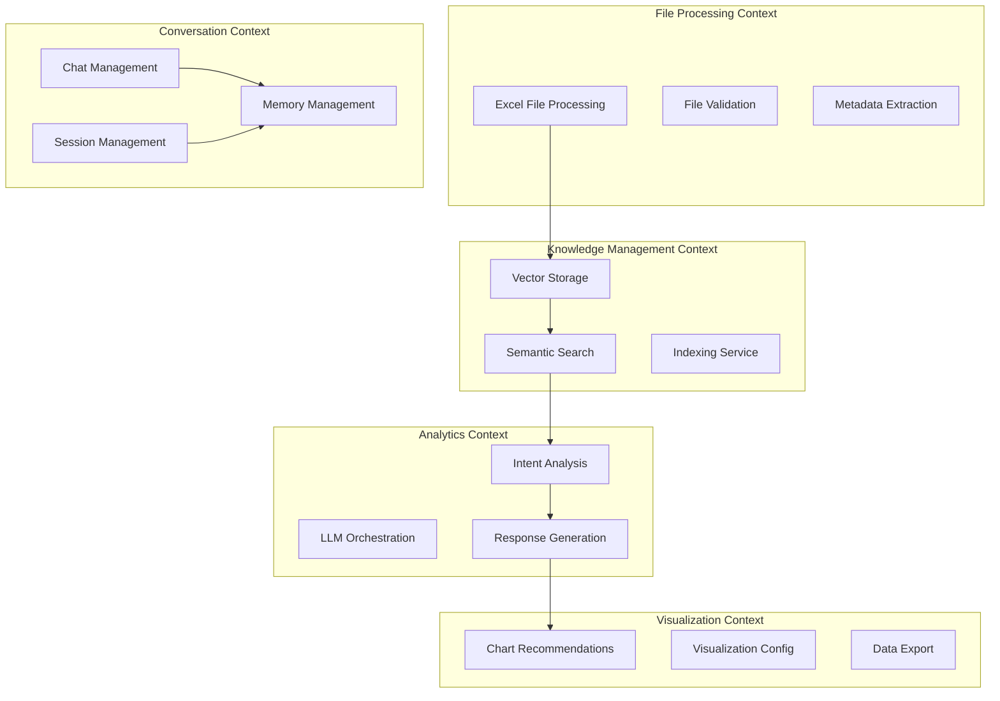
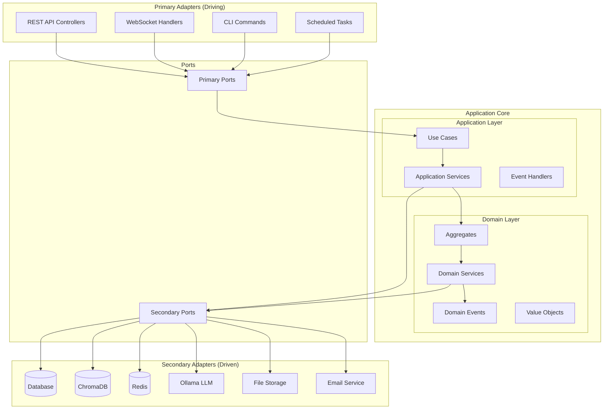
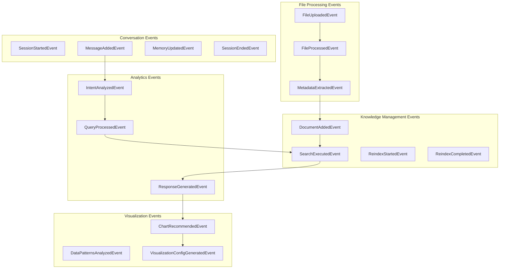
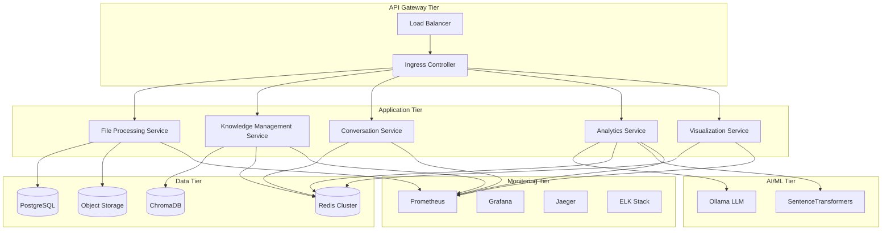
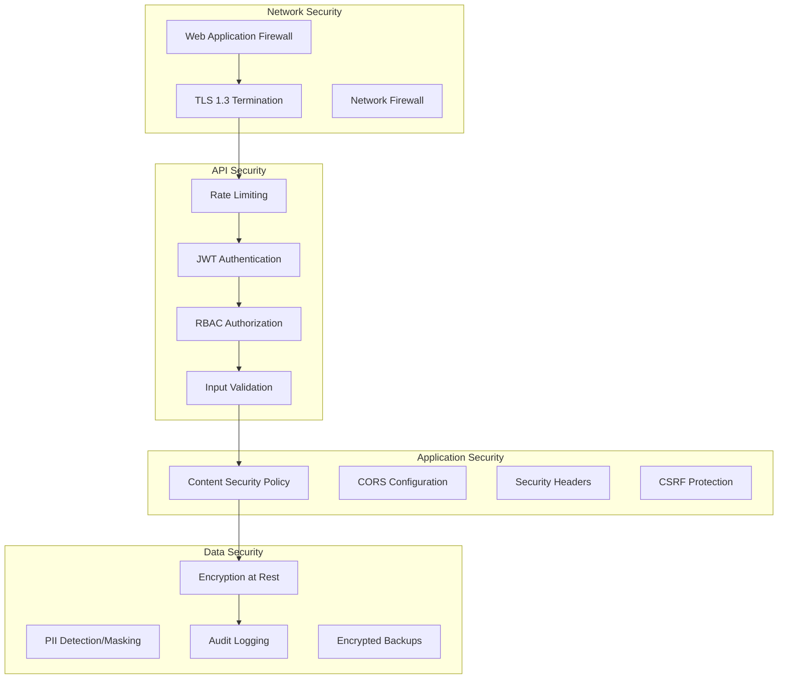

# Excel Chat Agent - Domain-Driven Architecture Design

## 1. Domain Analysis & Bounded Contexts

### 1.1 Business Domain Overview

**Primary Domain**: Excel Data Analysis and Conversational Insights  
**Core Value Proposition**: Transform complex Excel data into accessible, conversational analytics experiences  
**Key Stakeholders**: Business analysts, data analysts, managers, office workers  

**Critical Business Processes**:
1. **Data Ingestion**: Excel file upload → validation → processing → metadata extraction
2. **Knowledge Creation**: Data chunking → vectorization → semantic indexing → storage
3. **Conversational Analysis**: Query processing → semantic search → LLM analysis → response generation
4. **Insight Delivery**: Structured responses → visualization recommendations → export capabilities

### 1.2 Bounded Context Definition



## 2. Bounded Context Specifications

### 2.1 File Processing Bounded Context

**Domain Purpose**: Manage Excel file lifecycle from upload to structured data extraction

**Aggregate Root**: `ExcelFile`
```python
class ExcelFile:
    """Aggregate Root for file processing domain"""
    file_id: FileId
    file_name: FileName  
    file_path: FilePath
    file_hash: FileHash
    processing_status: ProcessingStatus
    upload_timestamp: datetime
    user_id: UserId
    sheets: List[Sheet]
    
    def upload(self, content: bytes, user: User) -> FileUploadedEvent
    def process(self) -> FileProcessedEvent
    def validate(self) -> ValidationResult
    def extract_metadata(self) -> MetadataExtractedEvent
```

**Entities**:
- `Sheet`: sheet_id, sheet_name, row_count, column_count, data_types, sample_data
- `DataChunk`: chunk_id, content, chunk_type, row_range, metadata

**Value Objects**:
- `FileId`, `FileName`, `FilePath`, `FileHash`
- `ProcessingStatus` (UPLOADED, PROCESSING, COMPLETED, FAILED)
- `ValidationResult` (valid: bool, errors: List[ValidationError])

**Domain Services**:
- `ExcelParsingService`: Parse Excel files with pandas/openpyxl integration
- `MetadataExtractionService`: Extract schema, statistics, column types
- `FileValidationService`: Validate format, size, integrity, security

**Repository Interfaces**:
```python
class ExcelFileRepository(ABC):
    async def save(self, file: ExcelFile) -> None
    async def find_by_id(self, file_id: FileId) -> Optional[ExcelFile]
    async def find_by_user(self, user_id: UserId) -> List[ExcelFile]
    async def delete(self, file_id: FileId) -> None
```

**Domain Events**:
- `FileUploadedEvent`: Triggers processing workflow
- `FileProcessedEvent`: Triggers vector indexing  
- `MetadataExtractedEvent`: Triggers UI updates
- `FileValidationFailedEvent`: Triggers error handling

**API Endpoints**:
```yaml
POST /api/files/upload:
  description: Upload Excel file for processing
  request: multipart/form-data
  response: FileUploadResponse

GET /api/files/{file_id}:
  description: Get file metadata and processing status
  response: FileMetadata

DELETE /api/files/{file_id}:
  description: Remove file and associated data
  response: DeletionConfirmation

GET /api/files/user/{user_id}:
  description: List user's uploaded files
  response: PaginatedFileList
```

### 2.2 Knowledge Management Bounded Context

**Domain Purpose**: Transform processed Excel data into searchable knowledge vectors

**Aggregate Root**: `DocumentCollection`
```python
class DocumentCollection:
    """Aggregate Root for knowledge management"""
    collection_id: CollectionId
    user_id: UserId
    name: CollectionName
    created_at: datetime
    document_count: int
    last_indexed: datetime
    documents: List[VectorDocument]
    
    def add_document(self, content: str, metadata: DocumentMetadata) -> DocumentAddedEvent
    def search(self, query: SearchQuery) -> SearchResults
    def reindex(self) -> ReindexStartedEvent
    def get_statistics(self) -> CollectionStatistics
```

**Entities**:
- `VectorDocument`: document_id, content, embedding_vector, metadata, indexed_at
- `SearchQuery`: query_text, filters, max_results, similarity_threshold
- `SearchResult`: document, similarity_score, metadata

**Value Objects**:
- `CollectionId`, `CollectionName`, `DocumentId`
- `EmbeddingVector` (List[float] with validation)
- `SearchFilters` (file_name, sheet_name, chunk_type)
- `SimilarityScore` (0.0 to 1.0 range)

**Domain Services**:
- `VectorEmbeddingService`: Generate embeddings using SentenceTransformers
- `SemanticSearchService`: Perform similarity search with ChromaDB
- `IndexingService`: Batch process and optimize vector operations
- `SearchOptimizationService`: Query optimization and result ranking

**Repository Interfaces**:
```python
class DocumentCollectionRepository(ABC):
    async def save_collection(self, collection: DocumentCollection) -> None
    async def find_collection(self, collection_id: CollectionId) -> Optional[DocumentCollection]
    async def add_documents_batch(self, documents: List[VectorDocument]) -> BatchResult
    async def search_similar(self, query: SearchQuery) -> SearchResults
```

**Domain Events**:
- `DocumentAddedEvent`: New document indexed
- `SearchExecutedEvent`: Search query completed
- `ReindexStartedEvent`: Collection reindexing initiated
- `ReindexCompletedEvent`: Reindexing finished

**API Endpoints**:
```yaml
POST /api/knowledge/collections:
  description: Create new document collection
  request: CreateCollectionRequest
  response: CollectionCreated

POST /api/knowledge/collections/{collection_id}/search:
  description: Perform semantic search
  request: SearchRequest
  response: SearchResults

POST /api/knowledge/collections/{collection_id}/documents:
  description: Add documents to collection
  request: AddDocumentsRequest
  response: DocumentsAdded

GET /api/knowledge/collections/{collection_id}/stats:
  description: Get collection statistics
  response: CollectionStatistics
```

### 2.3 Conversation Bounded Context

**Domain Purpose**: Manage chat sessions and conversation memory across user interactions

**Aggregate Root**: `ChatSession`
```python
class ChatSession:
    """Aggregate Root for conversation management"""
    session_id: SessionId
    user_id: UserId
    created_at: datetime
    last_activity: datetime
    status: SessionStatus
    conversation_memory: ConversationMemory
    messages: List[Message]
    preferences: UserPreferences
    
    def start_session(self, user: User) -> SessionStartedEvent
    def add_message(self, content: str, message_type: MessageType) -> MessageAddedEvent
    def end_session(self) -> SessionEndedEvent
    def update_memory(self, context: ConversationContext) -> None
```

**Entities**:
- `Message`: message_id, content, message_type, timestamp, sources, confidence_score
- `ConversationMemory`: chat_history, context_window, key_topics, user_preferences

**Value Objects**:
- `SessionId`, `MessageId`, `SessionStatus` (ACTIVE, IDLE, ENDED)
- `MessageType` (USER, ASSISTANT, SYSTEM)
- `ConversationContext`: recent_messages, file_context, query_history
- `UserPreferences`: preferred_chart_types, analysis_style, response_length

**Domain Services**:
- `SessionManagementService`: Create, maintain, cleanup sessions
- `MessageRoutingService`: Route between WebSocket and processing services
- `ContextManagementService`: Maintain conversation context with LangChain
- `MemoryOptimizationService`: Optimize memory usage and retention

**Repository Interfaces**:
```python
class ChatSessionRepository(ABC):
    async def save_session(self, session: ChatSession) -> None
    async def find_session(self, session_id: SessionId) -> Optional[ChatSession]
    async def find_active_sessions(self, user_id: UserId) -> List[ChatSession]
    async def cleanup_expired_sessions(self) -> CleanupResult
```

**Domain Events**:
- `SessionStartedEvent`: New chat session created
- `MessageAddedEvent`: Message added to conversation
- `SessionEndedEvent`: Session terminated and cleaned up
- `MemoryUpdatedEvent`: Conversation memory updated

**API/WebSocket Endpoints**:
```yaml
WebSocket /ws/chat/{session_id}:
  description: Real-time chat communication
  events:
    - user_message
    - assistant_response
    - typing_indicator
    - heartbeat

POST /api/conversations/sessions:
  description: Create new chat session
  request: CreateSessionRequest
  response: SessionCreated

GET /api/conversations/sessions/{session_id}/history:
  description: Get conversation history
  response: ConversationHistory

DELETE /api/conversations/sessions/{session_id}:
  description: End session and cleanup
  response: SessionEnded
```

### 2.4 Analytics Bounded Context

**Domain Purpose**: Orchestrate LLM-powered analysis and response generation

**Aggregate Root**: `AnalysisRequest`
```python
class AnalysisRequest:
    """Aggregate Root for analytics processing"""
    request_id: RequestId
    user_id: UserId
    session_id: SessionId
    query: QueryText
    intent: QueryIntent
    context: List[ContextDocument]
    processing_status: ProcessingStatus
    created_at: datetime
    response: Optional[AIResponse]
    
    def analyze_intent(self) -> IntentAnalyzedEvent
    def process_query(self, context: List[ContextDocument]) -> QueryProcessedEvent
    def generate_response(self) -> ResponseGeneratedEvent
    def stream_response(self) -> AsyncGenerator[ResponseChunk]
```

**Entities**:
- `AIResponse`: response_id, content, processing_time, confidence, sources, metadata
- `QueryIntent`: intent_type, confidence_score, parameters
- `ContextDocument`: document_id, content, relevance_score, source_metadata

**Value Objects**:
- `RequestId`, `QueryText`, `ProcessingStatus`
- `IntentType` (DATA_SUMMARY, STATISTICAL_ANALYSIS, COMPARISON, VISUALIZATION, CALCULATION)
- `ConfidenceScore` (0.0 to 1.0)
- `ProcessingMetrics`: processing_time_ms, tokens_used, cache_hit

**Domain Services**:
- `IntentAnalysisService`: Determine query type and extract parameters
- `LLMOrchestrationService`: Coordinate with LangChain and Ollama
- `ResponseGenerationService`: Stream responses with memory management
- `ContextRetrievalService`: Retrieve and rank relevant documents

**Repository Interfaces**:
```python
class AnalysisRequestRepository(ABC):
    async def save_request(self, request: AnalysisRequest) -> None
    async def find_request(self, request_id: RequestId) -> Optional[AnalysisRequest]
    async def find_by_session(self, session_id: SessionId) -> List[AnalysisRequest]
    async def save_response(self, response: AIResponse) -> None
```

**Domain Events**:
- `IntentAnalyzedEvent`: Query intent determined
- `QueryProcessedEvent`: Analysis request processed
- `ResponseGeneratedEvent`: AI response generated
- `StreamingStartedEvent`: Response streaming initiated

**API Endpoints**:
```yaml
POST /api/analytics/queries:
  description: Submit analytical query
  request: QueryRequest
  response: QueryResponse

GET /api/analytics/requests/{request_id}:
  description: Get analysis request status
  response: RequestStatus

GET /api/analytics/intents:
  description: Get supported query types
  response: SupportedIntents

POST /api/analytics/batch:
  description: Process multiple queries
  request: BatchQueryRequest
  response: BatchQueryResponse
```

### 2.5 Visualization Bounded Context

**Domain Purpose**: Generate data visualization recommendations and configurations

**Aggregate Root**: `ChartRecommendation`
```python
class ChartRecommendation:
    """Aggregate Root for visualization management"""
    recommendation_id: RecommendationId
    user_id: UserId
    data_summary: DataSummary
    chart_type: ChartType
    title: ChartTitle
    axes_mapping: AxesMapping
    priority: Priority
    created_at: datetime
    visualization_spec: VisualizationSpec
    
    def analyze_data_patterns(self, data: DataSummary) -> DataPatternsAnalyzedEvent
    def recommend_charts(self) -> ChartRecommendedEvent
    def generate_config(self) -> VisualizationConfigGeneratedEvent
    def export_visualization(self, format: ExportFormat) -> VisualizationExportedEvent
```

**Entities**:
- `VisualizationSpec`: spec_id, chart_config, data_mapping, styling_options
- `DataVisualization`: visualization_id, chart_data, chart_type, export_url

**Value Objects**:
- `ChartType` (BAR, LINE, PIE, SCATTER, HEATMAP, BOX_PLOT)
- `AxesMapping`: x_axis, y_axis, color_axis, size_axis
- `Priority` (1-5 scale), `ExportFormat` (PNG, SVG, PDF, EXCEL)
- `StylingOptions`: colors, themes, fonts, dimensions

**Domain Services**:
- `ChartRecommendationService`: Analyze data patterns and recommend charts
- `VisualizationConfigService`: Generate chart configurations
- `DataExportService`: Export visualizations to various formats
- `PatternAnalysisService`: Identify optimal visualization patterns

**Repository Interfaces**:
```python
class ChartRecommendationRepository(ABC):
    async def save_recommendation(self, recommendation: ChartRecommendation) -> None
    async def find_recommendation(self, recommendation_id: RecommendationId) -> Optional[ChartRecommendation]
    async def find_by_data_pattern(self, pattern: DataPattern) -> List[ChartRecommendation]
    async def save_visualization(self, visualization: DataVisualization) -> None
```

**Domain Events**:
- `DataPatternsAnalyzedEvent`: Data patterns identified
- `ChartRecommendedEvent`: Chart recommendation generated
- `VisualizationConfigGeneratedEvent`: Visualization config created
- `VisualizationExportedEvent`: Visualization exported

**API Endpoints**:
```yaml
POST /api/visualizations/recommend:
  description: Get chart recommendations for data
  request: RecommendationRequest
  response: ChartRecommendations

POST /api/visualizations/generate:
  description: Generate visualization configuration
  request: VisualizationRequest
  response: VisualizationConfig

GET /api/visualizations/{viz_id}/export:
  description: Export visualization
  query: format (png|svg|pdf|excel)
  response: ExportedVisualization

GET /api/visualizations/patterns:
  description: Get supported visualization patterns
  response: VisualizationPatterns
```

## 3. Hexagonal Architecture Implementation

### 3.1 Architecture Overview



### 3.2 Port Definitions

**Primary Ports (Inbound)**:
```python
# File Processing Port
class FileProcessingPort(ABC):
    async def upload_file(self, command: UploadFileCommand) -> FileUploadResult
    async def get_file_status(self, query: GetFileStatusQuery) -> FileStatus
    async def delete_file(self, command: DeleteFileCommand) -> DeletionResult

# Knowledge Management Port  
class KnowledgeManagementPort(ABC):
    async def search_documents(self, query: SearchDocumentsQuery) -> SearchResults
    async def create_collection(self, command: CreateCollectionCommand) -> CollectionCreated
    async def reindex_collection(self, command: ReindexCollectionCommand) -> ReindexResult

# Conversation Management Port
class ConversationManagementPort(ABC):
    async def start_session(self, command: StartSessionCommand) -> SessionStarted
    async def send_message(self, command: SendMessageCommand) -> MessageSent
    async def end_session(self, command: EndSessionCommand) -> SessionEnded

# Analytics Port
class AnalyticsPort(ABC):
    async def process_query(self, command: ProcessQueryCommand) -> QueryResult
    async def stream_response(self, command: StreamResponseCommand) -> AsyncGenerator[ResponseChunk]
    async def analyze_intent(self, query: AnalyzeIntentQuery) -> IntentAnalysis

# Visualization Port
class VisualizationPort(ABC):
    async def recommend_charts(self, command: RecommendChartsCommand) -> ChartRecommendations
    async def generate_visualization(self, command: GenerateVisualizationCommand) -> VisualizationConfig
    async def export_visualization(self, command: ExportVisualizationCommand) -> ExportResult
```

**Secondary Ports (Outbound)**:
```python
# Repository Ports
class FileRepositoryPort(ABC):
    async def save_file(self, file: ExcelFile) -> None
    async def find_file(self, file_id: FileId) -> Optional[ExcelFile]
    async def delete_file(self, file_id: FileId) -> None

class VectorRepositoryPort(ABC):
    async def store_vectors(self, documents: List[VectorDocument]) -> None
    async def search_similar(self, query: SearchQuery) -> SearchResults
    async def delete_collection(self, collection_id: CollectionId) -> None

class SessionRepositoryPort(ABC):
    async def save_session(self, session: ChatSession) -> None
    async def find_session(self, session_id: SessionId) -> Optional[ChatSession]
    async def cleanup_expired_sessions(self) -> None

# External Service Ports  
class LLMServicePort(ABC):
    async def generate_response(self, prompt: str, context: List[str]) -> LLMResponse
    async def stream_response(self, prompt: str, context: List[str]) -> AsyncGenerator[str]
    async def analyze_intent(self, query: str) -> IntentAnalysis

class CacheServicePort(ABC):
    async def get(self, key: str) -> Optional[str]
    async def set(self, key: str, value: str, ttl: int) -> None
    async def delete(self, key: str) -> None

class NotificationServicePort(ABC):
    async def send_notification(self, notification: Notification) -> NotificationResult
    async def send_email(self, email: EmailMessage) -> EmailResult
```

### 3.3 Adapter Implementations

**Primary Adapters**:
```python
# FastAPI REST Adapter
@router.post("/api/files/upload")
async def upload_file(
    file: UploadFile,
    current_user: User = Depends(get_current_user),
    file_service: FileProcessingPort = Depends(get_file_service)
):
    command = UploadFileCommand(
        file_content=await file.read(),
        file_name=file.filename,
        user_id=current_user.user_id
    )
    result = await file_service.upload_file(command)
    return FileUploadResponse.from_result(result)

# WebSocket Adapter
class WebSocketAdapter:
    def __init__(self, conversation_service: ConversationManagementPort):
        self.conversation_service = conversation_service
    
    async def handle_connection(self, websocket: WebSocket, session_id: str):
        await websocket.accept()
        
        async for message in websocket.iter_text():
            command = SendMessageCommand(
                session_id=SessionId(session_id),
                content=message,
                message_type=MessageType.USER
            )
            await self.conversation_service.send_message(command)
```

**Secondary Adapters**:
```python
# ChromaDB Vector Repository Adapter
class ChromaDBVectorRepositoryAdapter(VectorRepositoryPort):
    def __init__(self, client: chromadb.Client):
        self.client = client
    
    async def store_vectors(self, documents: List[VectorDocument]) -> None:
        collection = self.client.get_or_create_collection("excel_documents")
        
        ids = [doc.document_id.value for doc in documents]
        embeddings = [doc.embedding_vector.value for doc in documents]
        metadatas = [doc.metadata.to_dict() for doc in documents]
        documents_text = [doc.content for doc in documents]
        
        collection.add(
            ids=ids,
            embeddings=embeddings,
            metadatas=metadatas,
            documents=documents_text
        )

# Ollama LLM Service Adapter
class OllamaLLMServiceAdapter(LLMServicePort):
    def __init__(self, client: ollama.AsyncClient):
        self.client = client
    
    async def generate_response(self, prompt: str, context: List[str]) -> LLMResponse:
        full_prompt = self._build_prompt(prompt, context)
        
        response = await self.client.generate(
            model="llama3",
            prompt=full_prompt,
            stream=False
        )
        
        return LLMResponse(
            content=response['response'],
            tokens_used=response.get('tokens', 0),
            processing_time_ms=response.get('total_duration', 0) // 1_000_000
        )
```

## 4. Event-Driven Integration Architecture

### 4.1 Event Flow Design



### 4.2 Event Specifications

**Base Event Structure**:
```python
@dataclass
class DomainEvent:
    event_id: EventId
    aggregate_id: AggregateId
    event_type: str
    occurred_at: datetime
    version: int
    causation_id: Optional[EventId] = None
    correlation_id: Optional[CorrelationId] = None
    metadata: Dict[str, Any] = field(default_factory=dict)

class FileUploadedEvent(DomainEvent):
    file_id: FileId
    file_name: str
    file_size: int
    user_id: UserId
    upload_path: str

class FileProcessedEvent(DomainEvent):
    file_id: FileId
    processing_result: ProcessingResult
    sheets_count: int
    total_rows: int
    processing_time_ms: int

class DocumentAddedEvent(DomainEvent):
    collection_id: CollectionId
    document_id: DocumentId
    content_hash: str
    embedding_dimension: int
    metadata: DocumentMetadata
```

### 4.3 Event Handlers

```python
class FileProcessedEventHandler:
    def __init__(
        self,
        knowledge_service: KnowledgeManagementPort,
        notification_service: NotificationServicePort
    ):
        self.knowledge_service = knowledge_service
        self.notification_service = notification_service
    
    async def handle(self, event: FileProcessedEvent) -> None:
        # Create vector documents from processed file
        create_command = CreateDocumentsCommand(
            collection_id=CollectionId(f"user_{event.user_id}"),
            file_id=event.file_id,
            processing_result=event.processing_result
        )
        
        await self.knowledge_service.create_documents(create_command)
        
        # Notify user of completion
        notification = ProcessingCompleteNotification(
            user_id=event.user_id,
            file_name=event.file_name,
            processing_time=event.processing_time_ms
        )
        
        await self.notification_service.send_notification(notification)

class QueryProcessedEventHandler:
    def __init__(
        self,
        conversation_service: ConversationManagementPort,
        analytics_service: AnalyticsPort
    ):
        self.conversation_service = conversation_service
        self.analytics_service = analytics_service
    
    async def handle(self, event: QueryProcessedEvent) -> None:
        # Generate response using analytics service
        response_command = GenerateResponseCommand(
            request_id=event.request_id,
            query=event.query,
            context=event.context,
            intent=event.intent
        )
        
        response_result = await self.analytics_service.generate_response(response_command)
        
        # Add response to conversation
        message_command = AddMessageCommand(
            session_id=event.session_id,
            content=response_result.content,
            message_type=MessageType.ASSISTANT,
            sources=response_result.sources
        )
        
        await self.conversation_service.add_message(message_command)
```

### 4.4 Event Store Implementation

```python
class EventStore:
    def __init__(self, repository: EventRepositoryPort):
        self.repository = repository
        self.handlers: Dict[str, List[EventHandler]] = {}
    
    def register_handler(self, event_type: str, handler: EventHandler) -> None:
        if event_type not in self.handlers:
            self.handlers[event_type] = []
        self.handlers[event_type].append(handler)
    
    async def append_event(self, event: DomainEvent) -> None:
        # Store event
        await self.repository.save_event(event)
        
        # Dispatch to handlers
        if event.event_type in self.handlers:
            for handler in self.handlers[event.event_type]:
                await handler.handle(event)
    
    async def get_events(
        self, 
        aggregate_id: AggregateId, 
        from_version: int = 0
    ) -> List[DomainEvent]:
        return await self.repository.get_events(aggregate_id, from_version)
```

## 5. API Specifications Following DDD Patterns

### 5.1 REST API Design Principles

**Resource-Oriented Design**:
- Resources represent domain aggregates and entities
- HTTP verbs map to domain operations
- Consistent error handling and response formats
- Hypermedia controls for navigability

**API Versioning Strategy**:
- Header-based versioning: `Accept: application/vnd.excel-chat.v1+json`
- Semantic versioning for breaking changes
- Backward compatibility for minor versions

### 5.2 OpenAPI Specification Structure

```yaml
openapi: 3.0.3
info:
  title: Excel Chat Agent API
  version: 1.0.0
  description: Domain-driven API for Excel data analysis and conversational insights

servers:
  - url: https://api.excel-chat.local/v1
    description: Production API
  - url: http://localhost:8000/api/v1
    description: Development API

components:
  securitySchemes:
    BearerAuth:
      type: http
      scheme: bearer
      bearerFormat: JWT
  
  schemas:
    # File Processing Domain
    FileUploadRequest:
      type: object
      properties:
        file:
          type: string
          format: binary
          description: Excel file content
        processing_options:
          $ref: '#/components/schemas/ProcessingOptions'
      required:
        - file
    
    ExcelFile:
      type: object
      properties:
        file_id:
          type: string
          format: uuid
        file_name:
          type: string
          maxLength: 255
        file_size:
          type: integer
          minimum: 0
        processing_status:
          type: string
          enum: [UPLOADED, PROCESSING, COMPLETED, FAILED]
        upload_timestamp:
          type: string
          format: date-time
        sheets:
          type: array
          items:
            $ref: '#/components/schemas/Sheet'
        metadata:
          $ref: '#/components/schemas/FileMetadata'
    
    # Knowledge Management Domain
    SearchRequest:
      type: object
      properties:
        query:
          type: string
          minLength: 1
          maxLength: 1000
        filters:
          $ref: '#/components/schemas/SearchFilters'
        max_results:
          type: integer
          minimum: 1
          maximum: 20
          default: 5
        similarity_threshold:
          type: number
          minimum: 0.0
          maximum: 1.0
          default: 0.7
      required:
        - query
    
    SearchResult:
      type: object
      properties:
        document_id:
          type: string
          format: uuid
        content:
          type: string
        similarity_score:
          type: number
          minimum: 0.0
          maximum: 1.0
        metadata:
          $ref: '#/components/schemas/DocumentMetadata'
        source_info:
          $ref: '#/components/schemas/SourceInfo'
    
    # Analytics Domain
    QueryRequest:
      type: object
      properties:
        question:
          type: string
          minLength: 1
          maxLength: 1000
        session_id:
          type: string
          format: uuid
        file_filters:
          type: array
          items:
            type: string
        intent_hint:
          type: string
          enum: [DATA_SUMMARY, STATISTICAL_ANALYSIS, COMPARISON, VISUALIZATION, CALCULATION]
        streaming:
          type: boolean
          default: true
      required:
        - question
        - session_id
    
    AnalyticsResponse:
      type: object
      properties:
        request_id:
          type: string
          format: uuid
        answer:
          type: string
        intent:
          type: string
        confidence:
          type: number
          minimum: 0.0
          maximum: 1.0
        sources:
          type: array
          items:
            $ref: '#/components/schemas/SourceReference'
        processing_metrics:
          $ref: '#/components/schemas/ProcessingMetrics'
        visualization_recommendations:
          type: array
          items:
            $ref: '#/components/schemas/ChartRecommendation'

paths:
  # File Processing Endpoints
  /files:
    post:
      summary: Upload Excel file
      operationId: uploadFile
      security:
        - BearerAuth: []
      requestBody:
        content:
          multipart/form-data:
            schema:
              $ref: '#/components/schemas/FileUploadRequest'
      responses:
        '201':
          description: File uploaded successfully
          content:
            application/json:
              schema:
                $ref: '#/components/schemas/ExcelFile'
        '400':
          description: Invalid file format or size
        '401':
          description: Authentication required
        '413':
          description: File too large
  
  /files/{file_id}:
    get:
      summary: Get file information
      operationId: getFile
      security:
        - BearerAuth: []
      parameters:
        - name: file_id
          in: path
          required: true
          schema:
            type: string
            format: uuid
      responses:
        '200':
          description: File information retrieved
          content:
            application/json:
              schema:
                $ref: '#/components/schemas/ExcelFile'
        '404':
          description: File not found
        '403':
          description: Access denied
    
    delete:
      summary: Delete file
      operationId: deleteFile
      security:
        - BearerAuth: []
      parameters:
        - name: file_id
          in: path
          required: true
          schema:
            type: string
            format: uuid
      responses:
        '204':
          description: File deleted successfully
        '404':
          description: File not found
        '403':
          description: Access denied

  # Knowledge Management Endpoints
  /knowledge/search:
    post:
      summary: Search documents semantically
      operationId: searchDocuments
      security:
        - BearerAuth: []
      requestBody:
        content:
          application/json:
            schema:
              $ref: '#/components/schemas/SearchRequest'
      responses:
        '200':
          description: Search results
          content:
            application/json:
              schema:
                type: object
                properties:
                  results:
                    type: array
                    items:
                      $ref: '#/components/schemas/SearchResult'
                  total_count:
                    type: integer
                  query_time_ms:
                    type: integer

  # Analytics Endpoints
  /analytics/query:
    post:
      summary: Process analytical query
      operationId: processQuery
      security:
        - BearerAuth: []
      requestBody:
        content:
          application/json:
            schema:
              $ref: '#/components/schemas/QueryRequest'
      responses:
        '200':
          description: Query processed successfully
          content:
            application/json:
              schema:
                $ref: '#/components/schemas/AnalyticsResponse'
        '400':
          description: Invalid query format

  # Visualization Endpoints
  /visualizations/recommend:
    post:
      summary: Get chart recommendations
      operationId: recommendCharts
      security:
        - BearerAuth: []
      requestBody:
        content:
          application/json:
            schema:
              type: object
              properties:
                data_summary:
                  type: string
                query_context:
                  type: string
                preferred_types:
                  type: array
                  items:
                    type: string
      responses:
        '200':
          description: Chart recommendations generated
          content:
            application/json:
              schema:
                type: object
                properties:
                  recommendations:
                    type: array
                    items:
                      $ref: '#/components/schemas/ChartRecommendation'
```

### 5.3 WebSocket API Specification

```yaml
# WebSocket Events Specification
websocket_events:
  # Connection Events
  connection_established:
    description: Client successfully connected
    payload:
      session_id: string
      server_time: datetime
      heartbeat_interval: integer

  # Message Events  
  user_message:
    description: User sent a message
    payload:
      content: string
      timestamp: datetime
      message_id: string

  assistant_response_start:
    description: Assistant begins responding
    payload:
      request_id: string
      estimated_tokens: integer
      intent: string

  assistant_response_chunk:
    description: Partial response content
    payload:
      request_id: string
      content: string
      chunk_index: integer
      is_final: boolean

  assistant_response_complete:
    description: Response generation completed
    payload:
      request_id: string
      total_tokens: integer
      processing_time_ms: integer
      sources: array
      confidence: number

  # System Events
  typing_indicator:
    description: Show/hide typing indicator
    payload:
      is_typing: boolean
      entity: string # 'user' or 'assistant'

  error:
    description: Error occurred during processing
    payload:
      error_code: string
      error_message: string
      request_id: string
      timestamp: datetime

  heartbeat:
    description: Connection health check
    payload:
      timestamp: datetime
      server_status: string

# WebSocket Connection Flow
connection_flow:
  1. Client connects to /ws/chat/{session_id}
  2. Server sends connection_established event
  3. Client sends heartbeat every 30 seconds
  4. Client sends user_message events
  5. Server responds with assistant_response_* events
  6. Connection maintained until client disconnects or timeout
```

## 6. Deployment and Scalability Architecture

### 6.1 Container Architecture



### 6.2 Kubernetes Deployment Strategy

```yaml
# File Processing Service Deployment
apiVersion: apps/v1
kind: Deployment
metadata:
  name: file-processing-service
  labels:
    app: excel-chat
    component: file-processing
spec:
  replicas: 3
  strategy:
    type: RollingUpdate
    rollingUpdate:
      maxSurge: 1
      maxUnavailable: 0
  selector:
    matchLabels:
      app: excel-chat
      component: file-processing
  template:
    metadata:
      labels:
        app: excel-chat
        component: file-processing
      annotations:
        prometheus.io/scrape: "true"
        prometheus.io/port: "8000"
        prometheus.io/path: "/metrics"
    spec:
      containers:
      - name: file-processing
        image: excel-chat/file-processing:v1.0.0
        ports:
        - containerPort: 8000
          name: http
        - containerPort: 9090
          name: metrics
        env:
        - name: DATABASE_URL
          valueFrom:
            secretKeyRef:
              name: database-credentials
              key: url
        - name: REDIS_URL
          valueFrom:
            configMapKeyRef:
              name: redis-config
              key: url
        resources:
          requests:
            memory: "512Mi"
            cpu: "250m"
          limits:
            memory: "1Gi"
            cpu: "500m"
        livenessProbe:
          httpGet:
            path: /health
            port: 8000
          initialDelaySeconds: 30
          periodSeconds: 10
        readinessProbe:
          httpGet:
            path: /ready
            port: 8000
          initialDelaySeconds: 5
          periodSeconds: 5

---
# Horizontal Pod Autoscaler
apiVersion: autoscaling/v2
kind: HorizontalPodAutoscaler
metadata:
  name: file-processing-hpa
spec:
  scaleTargetRef:
    apiVersion: apps/v1
    kind: Deployment
    name: file-processing-service
  minReplicas: 3
  maxReplicas: 10
  metrics:
  - type: Resource
    resource:
      name: cpu
      target:
        type: Utilization
        averageUtilization: 70
  - type: Resource
    resource:
      name: memory
      target:
        type: Utilization
        averageUtilization: 80
  - type: Pods
    pods:
      metric:
        name: requests_per_second
      target:
        type: AverageValue
        averageValue: "100"

---
# Service Definition
apiVersion: v1
kind: Service
metadata:
  name: file-processing-service
  labels:
    app: excel-chat
    component: file-processing
spec:
  selector:
    app: excel-chat
    component: file-processing
  ports:
  - name: http
    port: 80
    targetPort: 8000
  - name: metrics
    port: 9090
    targetPort: 9090
  type: ClusterIP
```

### 6.3 Data Tier Scaling Strategy

```yaml
# PostgreSQL Cluster Configuration
apiVersion: postgresql.cnpg.io/v1
kind: Cluster
metadata:
  name: postgres-cluster
spec:
  instances: 3
  primaryUpdateStrategy: unsupervised
  
  postgresql:
    parameters:
      max_connections: "200"
      shared_buffers: "256MB"
      effective_cache_size: "1GB"
      work_mem: "4MB"
      maintenance_work_mem: "64MB"
      random_page_cost: "1.1"
      effective_io_concurrency: "200"
  
  bootstrap:
    initdb:
      database: excel_chat
      owner: app_user
      secret:
        name: postgres-credentials
  
  storage:
    size: 100Gi
    storageClass: fast-ssd
  
  monitoring:
    enabled: true
    
  backup:
    retentionPolicy: "30d"
    target: "s3://backup-bucket/postgres"

---
# Redis Cluster Configuration  
apiVersion: redis.redis.opstreelabs.in/v1beta1
kind: RedisCluster
metadata:
  name: redis-cluster
spec:
  clusterSize: 6
  clusterVersion: v7
  redisSecret:
    name: redis-secret
    key: password
  storage:
    volumeClaimTemplate:
      spec:
        storageClassName: fast-ssd
        resources:
          requests:
            storage: 50Gi
  redisConfig:
    maxmemory: "2gb"
    maxmemory-policy: "allkeys-lru"
    save: "900 1 300 10 60 10000"
    
---
# ChromaDB StatefulSet
apiVersion: apps/v1
kind: StatefulSet
metadata:
  name: chromadb
spec:
  serviceName: chromadb
  replicas: 3
  selector:
    matchLabels:
      app: chromadb
  template:
    metadata:
      labels:
        app: chromadb
    spec:
      containers:
      - name: chromadb
        image: chromadb/chroma:latest
        ports:
        - containerPort: 8000
        env:
        - name: CHROMA_SERVER_HOST
          value: "0.0.0.0"
        - name: CHROMA_SERVER_HTTP_PORT
          value: "8000"
        volumeMounts:
        - name: chroma-data
          mountPath: /chroma/chroma
        resources:
          requests:
            memory: "1Gi"
            cpu: "500m"
          limits:
            memory: "2Gi"
            cpu: "1000m"
  volumeClaimTemplates:
  - metadata:
      name: chroma-data
    spec:
      storageClassName: fast-ssd
      accessModes: ["ReadWriteOnce"]
      resources:
        requests:
          storage: 100Gi
```

### 6.4 Monitoring and Observability

```yaml
# Service Monitor for Prometheus
apiVersion: monitoring.coreos.com/v1
kind: ServiceMonitor
metadata:
  name: excel-chat-services
  labels:
    app: excel-chat
spec:
  selector:
    matchLabels:
      app: excel-chat
  endpoints:
  - port: metrics
    path: /metrics
    interval: 30s
    scrapeTimeout: 10s

---
# Grafana Dashboard ConfigMap
apiVersion: v1
kind: ConfigMap
metadata:
  name: grafana-dashboards
data:
  excel-chat-dashboard.json: |
    {
      "dashboard": {
        "title": "Excel Chat Agent Metrics",
        "panels": [
          {
            "title": "Request Rate",
            "type": "graph",
            "targets": [
              {
                "expr": "rate(http_requests_total[5m])",
                "legendFormat": "{{method}} {{endpoint}}"
              }
            ]
          },
          {
            "title": "Response Time",
            "type": "graph",
            "targets": [
              {
                "expr": "histogram_quantile(0.95, rate(http_request_duration_seconds_bucket[5m]))",
                "legendFormat": "95th percentile"
              }
            ]
          },
          {
            "title": "File Processing Time",
            "type": "graph",
            "targets": [
              {
                "expr": "histogram_quantile(0.90, rate(file_processing_duration_seconds_bucket[5m]))",
                "legendFormat": "90th percentile"
              }
            ]
          },
          {
            "title": "LLM Response Time",
            "type": "graph", 
            "targets": [
              {
                "expr": "histogram_quantile(0.95, rate(llm_response_duration_seconds_bucket[5m]))",
                "legendFormat": "95th percentile"
              }
            ]
          }
        ]
      }
    }

---
# PrometheusRule for Alerting
apiVersion: monitoring.coreos.com/v1
kind: PrometheusRule
metadata:
  name: excel-chat-alerts
spec:
  groups:
  - name: excel-chat.rules
    rules:
    - alert: HighErrorRate
      expr: rate(http_requests_total{status=~"5.."}[5m]) > 0.1
      for: 2m
      labels:
        severity: critical
      annotations:
        summary: "High error rate detected"
        description: "Error rate is {{ $value }} errors per second"
    
    - alert: HighResponseTime
      expr: histogram_quantile(0.95, rate(http_request_duration_seconds_bucket[5m])) > 2
      for: 5m
      labels:
        severity: warning
      annotations:
        summary: "High response time detected"
        description: "95th percentile response time is {{ $value }} seconds"
    
    - alert: FileProcessingBacklog
      expr: file_processing_queue_size > 100
      for: 1m
      labels:
        severity: warning
      annotations:
        summary: "File processing backlog detected"
        description: "{{ $value }} files waiting for processing"
```

## 7. Security Architecture

### 7.1 Security Layers



### 7.2 Authentication & Authorization Implementation

```python
# JWT Token Service
class JWTTokenService:
    def __init__(self, secret_key: str, algorithm: str = "HS256"):
        self.secret_key = secret_key
        self.algorithm = algorithm
        self.access_token_expire_minutes = 480  # 8 hours
        self.refresh_token_expire_days = 7
    
    def create_access_token(self, subject: str, permissions: List[str]) -> str:
        expires_delta = timedelta(minutes=self.access_token_expire_minutes)
        expire = datetime.utcnow() + expires_delta
        
        to_encode = {
            "sub": subject,
            "exp": expire,
            "iat": datetime.utcnow(),
            "type": "access",
            "permissions": permissions
        }
        
        return jwt.encode(to_encode, self.secret_key, algorithm=self.algorithm)
    
    def verify_token(self, token: str) -> TokenPayload:
        try:
            payload = jwt.decode(token, self.secret_key, algorithms=[self.algorithm])
            
            if payload.get("type") != "access":
                raise AuthenticationError("Invalid token type")
            
            return TokenPayload(
                subject=payload.get("sub"),
                permissions=payload.get("permissions", []),
                expires_at=datetime.fromtimestamp(payload.get("exp"))
            )
        except jwt.ExpiredSignatureError:
            raise AuthenticationError("Token has expired")
        except jwt.InvalidTokenError:
            raise AuthenticationError("Invalid token")

# RBAC Implementation
class RBACAuthorizationService:
    def __init__(self):
        self.role_permissions = {
            "admin": [
                "files:read", "files:write", "files:delete",
                "analytics:read", "analytics:write",
                "users:read", "users:write", "system:admin"
            ],
            "analyst": [
                "files:read", "files:write",
                "analytics:read", "analytics:write"
            ],
            "viewer": [
                "files:read", "analytics:read"
            ]
        }
    
    def check_permission(self, user_roles: List[str], required_permission: str) -> bool:
        user_permissions = set()
        for role in user_roles:
            user_permissions.update(self.role_permissions.get(role, []))
        
        return required_permission in user_permissions
    
    def get_resource_permissions(self, user_id: str, resource_type: str, resource_id: str) -> List[str]:
        # Resource-level permissions (e.g., file ownership)
        if resource_type == "file":
            file_owner = self.get_file_owner(resource_id)
            if file_owner == user_id:
                return ["read", "write", "delete"]
        
        return ["read"]  # Default permissions

# FastAPI Security Dependencies
async def get_current_user(
    token: str = Depends(oauth2_scheme),
    token_service: JWTTokenService = Depends(get_token_service)
) -> User:
    try:
        payload = token_service.verify_token(token)
        user = await get_user_by_id(payload.subject)
        
        if user is None:
            raise AuthenticationError("User not found")
        
        return user
    except AuthenticationError:
        raise HTTPException(
            status_code=status.HTTP_401_UNAUTHORIZED,
            detail="Could not validate credentials",
            headers={"WWW-Authenticate": "Bearer"}
        )

def require_permission(permission: str):
    def dependency(
        current_user: User = Depends(get_current_user),
        authz_service: RBACAuthorizationService = Depends(get_authz_service)
    ):
        if not authz_service.check_permission(current_user.roles, permission):
            raise HTTPException(
                status_code=status.HTTP_403_FORBIDDEN,
                detail="Insufficient permissions"
            )
        return current_user
    
    return dependency
```

### 7.3 Data Protection Implementation

```python
# PII Detection and Masking
class PIIDetectionService:
    def __init__(self):
        self.patterns = {
            'email': r'\b[A-Za-z0-9._%+-]+@[A-Za-z0-9.-]+\.[A-Z|a-z]{2,}\b',
            'phone': r'\b\d{3}-\d{3}-\d{4}\b|\b\(\d{3}\)\s*\d{3}-\d{4}\b',
            'ssn': r'\b\d{3}-\d{2}-\d{4}\b',
            'credit_card': r'\b(?:\d{4}[-\s]?){3}\d{4}\b'
        }
    
    def detect_pii(self, data: pd.DataFrame) -> Dict[str, List[str]]:
        pii_columns = {}
        
        for column in data.columns:
            column_pii = []
            column_text = data[column].astype(str).str.cat(sep=' ')
            
            for pii_type, pattern in self.patterns.items():
                if re.search(pattern, column_text):
                    column_pii.append(pii_type)
            
            if column_pii:
                pii_columns[column] = column_pii
        
        return pii_columns
    
    def mask_pii(self, data: pd.DataFrame) -> pd.DataFrame:
        pii_columns = self.detect_pii(data)
        masked_data = data.copy()
        
        for column, pii_types in pii_columns.items():
            for pii_type in pii_types:
                pattern = self.patterns[pii_type]
                if pii_type == 'email':
                    replacement = lambda m: m.group(0)[:3] + '***@' + m.group(0).split('@')[1]
                elif pii_type == 'phone':
                    replacement = '***-***-****'
                elif pii_type == 'ssn':
                    replacement = '***-**-****'
                else:
                    replacement = '****'
                
                masked_data[column] = masked_data[column].astype(str).str.replace(
                    pattern, replacement, regex=True
                )
        
        return masked_data

# Encryption at Rest
class EncryptionService:
    def __init__(self, encryption_key: bytes):
        self.fernet = Fernet(encryption_key)
    
    def encrypt_file(self, file_path: Path) -> Path:
        with open(file_path, 'rb') as f:
            file_data = f.read()
        
        encrypted_data = self.fernet.encrypt(file_data)
        encrypted_path = file_path.with_suffix(file_path.suffix + '.enc')
        
        with open(encrypted_path, 'wb') as f:
            f.write(encrypted_data)
        
        return encrypted_path
    
    def decrypt_file(self, encrypted_path: Path) -> bytes:
        with open(encrypted_path, 'rb') as f:
            encrypted_data = f.read()
        
        return self.fernet.decrypt(encrypted_data)

# Audit Logging
class AuditLogger:
    def __init__(self, logger: Logger):
        self.logger = logger
    
    async def log_file_access(
        self, 
        user_id: str, 
        file_id: str, 
        action: str, 
        ip_address: str,
        user_agent: str
    ):
        audit_entry = {
            "event_type": "file_access",
            "user_id": user_id,
            "file_id": file_id,
            "action": action,
            "ip_address": ip_address,
            "user_agent": user_agent,
            "timestamp": datetime.utcnow().isoformat(),
            "session_id": self.get_session_id()
        }
        
        self.logger.info("AUDIT", extra=audit_entry)
    
    async def log_query_execution(
        self,
        user_id: str,
        query: str,
        files_accessed: List[str],
        response_confidence: float
    ):
        audit_entry = {
            "event_type": "query_execution",
            "user_id": user_id,
            "query_hash": hashlib.sha256(query.encode()).hexdigest(),
            "files_accessed": files_accessed,
            "response_confidence": response_confidence,
            "timestamp": datetime.utcnow().isoformat()
        }
        
        self.logger.info("AUDIT", extra=audit_entry)
```

## 8. Implementation Roadmap

### 8.1 Phase 1: Core Domain Implementation (Weeks 1-4)

**Week 1-2: Domain Foundation**
- [ ] Implement base domain models and value objects
- [ ] Create aggregate roots for all bounded contexts  
- [ ] Implement domain services and business logic
- [ ] Set up event sourcing infrastructure
- [ ] Create repository interfaces

**Week 3-4: Primary Adapters**
- [ ] Implement FastAPI REST controllers
- [ ] Set up WebSocket handlers for real-time communication
- [ ] Create OpenAPI documentation
- [ ] Implement authentication and authorization middleware
- [ ] Set up input validation and error handling

### 8.2 Phase 2: Secondary Adapters & Integration (Weeks 5-8)

**Week 5-6: Data Persistence**
- [ ] Implement PostgreSQL repository adapters
- [ ] Set up ChromaDB vector storage adapters
- [ ] Create Redis caching adapters
- [ ] Implement file storage adapters
- [ ] Set up database migrations

**Week 7-8: External Service Integration**
- [ ] Implement Ollama LLM service adapter
- [ ] Create SentenceTransformers embedding service
- [ ] Set up LangChain integration
- [ ] Implement notification services
- [ ] Create monitoring and health check endpoints

### 8.3 Phase 3: Advanced Features (Weeks 9-12)

**Week 9-10: Event-Driven Architecture**
- [ ] Implement event store and event bus
- [ ] Create event handlers for cross-context integration
- [ ] Set up async message processing
- [ ] Implement event replay and recovery
- [ ] Add distributed tracing

**Week 11-12: Production Features**
- [ ] Implement comprehensive security measures
- [ ] Set up monitoring and alerting
- [ ] Create deployment configurations
- [ ] Implement backup and disaster recovery
- [ ] Performance optimization and load testing

### 8.4 Phase 4: Deployment & Operations (Weeks 13-16)

**Week 13-14: Container & Orchestration**
- [ ] Create Docker containers for all services
- [ ] Set up Kubernetes deployments
- [ ] Implement service mesh configuration
- [ ] Configure ingress and load balancing
- [ ] Set up auto-scaling policies

**Week 15-16: Production Readiness**
- [ ] Set up CI/CD pipelines
- [ ] Implement infrastructure as code
- [ ] Create monitoring dashboards
- [ ] Set up log aggregation and analysis
- [ ] Conduct security audits and penetration testing

## Conclusion

This comprehensive Domain-Driven Design architecture provides a scalable, maintainable, and secure foundation for the Excel Chat Agent system. The design emphasizes:

1. **Clear Domain Boundaries**: Five distinct bounded contexts with well-defined responsibilities
2. **Hexagonal Architecture**: Clean separation between business logic and technical concerns
3. **Event-Driven Integration**: Loose coupling between contexts through domain events
4. **Production-Ready Patterns**: Security, monitoring, and deployment strategies
5. **Scalability**: Horizontal scaling patterns and performance optimization
6. **Maintainability**: Clean code principles and comprehensive testing strategies

The architecture supports current requirements while providing clear paths for future growth and evolution. Each bounded context can be developed, deployed, and scaled independently, enabling efficient team collaboration and system evolution.