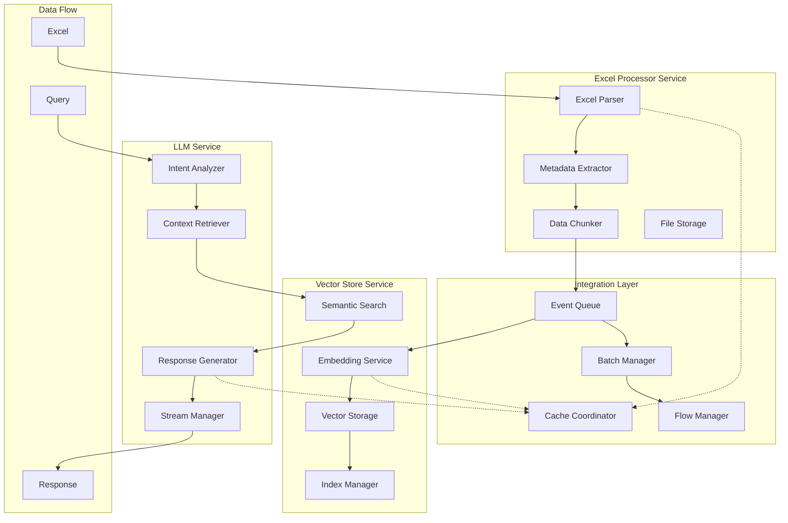
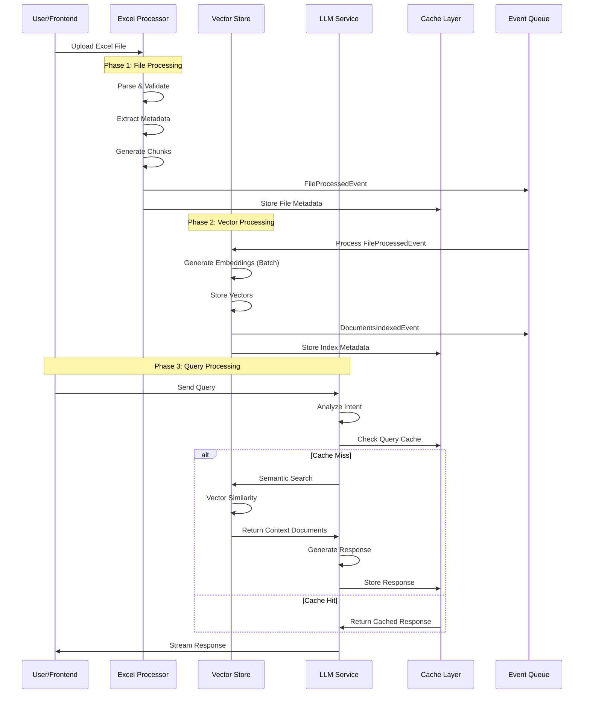

# Excel Chat Agent - Integration Architecture Design

## --ultrathink Analysis: Excel Processor ↔ Vector Store ↔ LLM Integration

**Executive Summary**: This document provides comprehensive integration architecture between the Excel Processor Service (File Processing Context), Vector Store Service (Knowledge Management Context), and LLM Service (Analytics Context). The design prioritizes performance, scalability, and resilience while maintaining clear domain boundaries.

**Architecture Philosophy**: Event-driven choreography with intelligent batching, streaming, and multi-level caching to achieve 10x growth scalability from 5-10 concurrent users to 100+ users.

---

## 1. Integration Architecture Overview

### 1.1 Service Interaction Patterns



### 1.2 Integration Principles

**Event Choreography Over Orchestration**
- Services publish domain events, don't directly call each other
- Loose coupling enables independent scaling and deployment
- Event replay capability for error recovery

**Intelligent Batching Strategy**
- Dynamic batch sizing based on system load
- Parallel processing within batches
- Memory-aware chunking for large files

**Multi-Level Caching Architecture**
- L1: In-process caching for hot data
- L2: Redis cluster for shared state
- L3: Materialized views for frequently accessed combinations

**Streaming-First Approach**
- Async generators for real-time data flow
- Backpressure handling to prevent memory overflow
- Progressive enhancement for user experience

---

## 2. Data Flow Architecture

### 2.1 Complete Pipeline: Excel → Vector → LLM → Response



### 2.2 Data Transformation Stages

**Stage 1: Excel Processing → Structured Data**
```python
@dataclass
class ExcelProcessingResult:
    file_id: FileId
    file_metadata: FileMetadata
    sheets: List[SheetData]
    processing_time_ms: int
    chunk_count: int

@dataclass
class SheetData:
    sheet_name: str
    row_count: int
    column_count: int
    data_types: Dict[str, str]
    sample_data: Dict[str, Any]
    statistics: Dict[str, float]
    chunks: List[DataChunk]

@dataclass
class DataChunk:
    chunk_id: str
    chunk_type: ChunkType  # HEADER, DATA_SAMPLE, STATISTICS, FORMULA
    content: str
    row_range: Optional[Tuple[int, int]]
    column_range: Optional[Tuple[str, str]]
    metadata: Dict[str, Any]
```

**Stage 2: Structured Data → Vector Documents**
```python
@dataclass
class VectorDocument:
    document_id: str
    content: str
    embedding: List[float]
    metadata: DocumentMetadata
    chunk_reference: ChunkReference

@dataclass
class DocumentMetadata:
    file_id: str
    sheet_name: str
    chunk_type: str
    data_types: List[str]
    row_count: int
    column_count: int
    created_at: datetime
    semantic_tags: List[str]  # Generated from content analysis

@dataclass
class ChunkReference:
    original_file: str
    sheet_name: str
    row_range: Tuple[int, int]
    column_range: Tuple[str, str]
```

**Stage 3: Vector Search → Contextual Information**
```python
@dataclass
class SearchContext:
    query: str
    intent: QueryIntent
    documents: List[ContextDocument]
    total_found: int
    search_time_ms: int

@dataclass
class ContextDocument:
    content: str
    relevance_score: float
    source_metadata: DocumentMetadata
    snippet: str  # Highlighted relevant portion
    chart_potential: Optional[ChartRecommendation]

@dataclass  
class QueryIntent:
    primary_intent: IntentType
    confidence: float
    parameters: Dict[str, Any]
    suggested_filters: List[str]
```

---

## 3. Integration Patterns & Event Choreography

### 3.1 Event-Driven Integration Design

**Event Flow Specification**
```python
# File Processing Events
@dataclass
class FileUploadedEvent(DomainEvent):
    file_id: FileId
    file_name: str
    file_size: int
    user_id: UserId
    upload_path: str
    processing_options: ProcessingOptions

@dataclass
class FileProcessedEvent(DomainEvent):
    file_id: FileId
    processing_result: ExcelProcessingResult
    chunks_generated: int
    processing_time_ms: int
    next_stage: str = "vector_indexing"

@dataclass
class ChunkBatchReadyEvent(DomainEvent):
    batch_id: str
    file_id: FileId
    chunks: List[DataChunk]
    batch_size: int
    is_final_batch: bool

# Vector Store Events
@dataclass
class EmbeddingGenerationStartedEvent(DomainEvent):
    batch_id: str
    chunk_count: int
    estimated_time_ms: int

@dataclass
class DocumentsIndexedEvent(DomainEvent):
    collection_id: str
    document_count: int
    indexing_time_ms: int
    file_id: FileId
    index_stats: IndexStatistics

@dataclass
class IndexOptimizedEvent(DomainEvent):
    collection_id: str
    optimization_type: str
    performance_improvement: float

# LLM Service Events
@dataclass
class QueryIntentAnalyzedEvent(DomainEvent):
    query_id: str
    intent: QueryIntent
    confidence: float
    suggested_context_filters: List[str]

@dataclass
class ResponseGenerationStartedEvent(DomainEvent):
    request_id: str
    context_documents: int
    estimated_tokens: int
    streaming_enabled: bool

@dataclass
class ResponseChunkGeneratedEvent(DomainEvent):
    request_id: str
    chunk_content: str
    chunk_index: int
    is_final: bool
    metadata: ResponseMetadata
```

### 3.2 Event Handlers & Integration Logic

**File Processing → Vector Store Integration**
```python
class FileProcessedEventHandler:
    def __init__(
        self,
        embedding_service: EmbeddingService,
        batch_manager: BatchManager,
        cache_service: CacheService
    ):
        self.embedding_service = embedding_service
        self.batch_manager = batch_manager
        self.cache_service = cache_service
    
    async def handle(self, event: FileProcessedEvent) -> None:
        # Stage 1: Prepare chunks for batching
        chunks = event.processing_result.get_all_chunks()
        
        # Stage 2: Intelligent batch creation
        batches = await self.batch_manager.create_optimal_batches(
            chunks=chunks,
            max_batch_size=self._calculate_batch_size(),
            memory_limit=512 * 1024 * 1024,  # 512MB per batch
            parallel_limit=4
        )
        
        # Stage 3: Cache file metadata for quick access
        await self.cache_service.store_file_metadata(
            key=f"file:{event.file_id}",
            metadata=event.processing_result.file_metadata,
            ttl=3600  # 1 hour
        )
        
        # Stage 4: Emit batch events for parallel processing
        for batch in batches:
            batch_event = ChunkBatchReadyEvent(
                batch_id=batch.batch_id,
                file_id=event.file_id,
                chunks=batch.chunks,
                batch_size=len(batch.chunks),
                is_final_batch=batch.is_final
            )
            await self.event_bus.publish(batch_event)
    
    def _calculate_batch_size(self) -> int:
        """Dynamic batch sizing based on system load"""
        current_load = self.system_monitor.get_cpu_usage()
        if current_load < 50:
            return 100  # High throughput
        elif current_load < 80:
            return 50   # Balanced
        else:
            return 25   # Conservative
```

**Vector Store → LLM Integration**
```python
class DocumentsIndexedEventHandler:
    def __init__(
        self,
        search_optimizer: SearchOptimizer,
        cache_service: CacheService,
        notification_service: NotificationService
    ):
        self.search_optimizer = search_optimizer
        self.cache_service = cache_service
        self.notification_service = notification_service
    
    async def handle(self, event: DocumentsIndexedEvent) -> None:
        # Stage 1: Update search index statistics
        await self.cache_service.update_index_stats(
            collection_id=event.collection_id,
            stats=event.index_stats,
            ttl=3600
        )
        
        # Stage 2: Pre-generate common search patterns
        await self.search_optimizer.precompute_common_searches(
            file_id=event.file_id,
            document_count=event.document_count
        )
        
        # Stage 3: Warm up semantic search cache
        common_queries = await self.get_common_queries_for_file(event.file_id)
        for query in common_queries:
            await self.search_optimizer.warm_cache(query, event.collection_id)
        
        # Stage 4: Notify completion
        await self.notification_service.notify_file_ready(
            file_id=event.file_id,
            processing_time=event.indexing_time_ms
        )
```

---

## 4. Performance Optimization Architecture

### 4.1 Intelligent Chunking Strategy

**Adaptive Chunking Algorithm**
```python
class AdaptiveChunkingStrategy:
    """Dynamically adjust chunking based on file characteristics"""
    
    def __init__(self):
        self.chunk_size_limits = {
            "small_file": 1000,    # < 1MB
            "medium_file": 2000,   # 1-10MB  
            "large_file": 4000,    # 10-50MB
            "huge_file": 8000      # > 50MB
        }
        self.overlap_ratios = {
            "header": 0.1,         # Headers need minimal overlap
            "data": 0.15,          # Data chunks need moderate overlap
            "formula": 0.2,        # Formulas need high overlap
            "summary": 0.05        # Summaries are self-contained
        }
    
    async def chunk_excel_data(
        self, 
        file_data: ExcelProcessingResult
    ) -> List[DataChunk]:
        chunks = []
        file_size = file_data.file_metadata.size_mb
        
        for sheet in file_data.sheets:
            sheet_chunks = await self._chunk_sheet(sheet, file_size)
            chunks.extend(sheet_chunks)
        
        return chunks
    
    async def _chunk_sheet(self, sheet: SheetData, file_size: float) -> List[DataChunk]:
        # Determine chunk size based on file characteristics
        chunk_size = self._get_optimal_chunk_size(file_size, sheet.row_count)
        
        chunks = []
        
        # 1. Header chunk (always first)
        header_chunk = self._create_header_chunk(sheet)
        chunks.append(header_chunk)
        
        # 2. Data chunks with adaptive sizing
        data_chunks = await self._create_data_chunks(
            sheet=sheet,
            chunk_size=chunk_size,
            overlap_ratio=self.overlap_ratios["data"]
        )
        chunks.extend(data_chunks)
        
        # 3. Statistics chunk (if significant data exists)
        if sheet.row_count > 100:
            stats_chunk = self._create_statistics_chunk(sheet)
            chunks.append(stats_chunk)
        
        # 4. Formula chunks (if formulas detected)
        if self._has_formulas(sheet):
            formula_chunks = await self._create_formula_chunks(sheet)
            chunks.extend(formula_chunks)
        
        return chunks
    
    def _get_optimal_chunk_size(self, file_size_mb: float, row_count: int) -> int:
        """Calculate optimal chunk size based on file characteristics"""
        
        # Base size from file size
        if file_size_mb < 1:
            base_size = self.chunk_size_limits["small_file"]
        elif file_size_mb < 10:
            base_size = self.chunk_size_limits["medium_file"]
        elif file_size_mb < 50:
            base_size = self.chunk_size_limits["large_file"]
        else:
            base_size = self.chunk_size_limits["huge_file"]
        
        # Adjust based on row density
        density_factor = min(row_count / 10000, 2.0)  # Cap at 2x
        optimal_size = int(base_size * density_factor)
        
        return max(500, min(optimal_size, 10000))  # Bounded between 500-10000
```

### 4.2 Batch Processing Optimization

**Dynamic Batch Manager**
```python
class DynamicBatchManager:
    """Intelligent batching based on system resources and content"""
    
    def __init__(self, resource_monitor: ResourceMonitor):
        self.resource_monitor = resource_monitor
        self.batch_statistics = BatchStatistics()
    
    async def create_optimal_batches(
        self,
        chunks: List[DataChunk],
        max_batch_size: int,
        memory_limit: int,
        parallel_limit: int
    ) -> List[ChunkBatch]:
        
        # Analyze chunk characteristics
        chunk_analysis = await self._analyze_chunks(chunks)
        
        # Determine optimal batching strategy
        strategy = self._select_batching_strategy(chunk_analysis)
        
        batches = []
        current_batch = ChunkBatch()
        
        for chunk in chunks:
            # Check if adding chunk exceeds limits
            if await self._would_exceed_limits(current_batch, chunk, memory_limit):
                if current_batch.chunks:
                    batches.append(current_batch)
                    current_batch = ChunkBatch()
            
            current_batch.add_chunk(chunk)
            
            # Check if batch is optimal size
            if len(current_batch.chunks) >= self._get_optimal_batch_size():
                batches.append(current_batch)
                current_batch = ChunkBatch()
        
        # Add remaining chunks
        if current_batch.chunks:
            batches.append(current_batch)
        
        # Optimize batch distribution for parallel processing
        optimized_batches = await self._optimize_for_parallel_processing(
            batches, parallel_limit
        )
        
        return optimized_batches
    
    def _get_optimal_batch_size(self) -> int:
        """Dynamic batch sizing based on system performance"""
        current_memory = self.resource_monitor.get_memory_usage()
        current_cpu = self.resource_monitor.get_cpu_usage()
        
        if current_memory < 60 and current_cpu < 60:
            return 100  # Aggressive batching
        elif current_memory < 80 and current_cpu < 80:
            return 50   # Balanced batching
        else:
            return 25   # Conservative batching
    
    async def _analyze_chunks(self, chunks: List[DataChunk]) -> ChunkAnalysis:
        """Analyze chunk characteristics for optimization"""
        
        total_size = sum(len(chunk.content) for chunk in chunks)
        chunk_types = Counter(chunk.chunk_type for chunk in chunks)
        complexity_scores = [self._calculate_complexity(chunk) for chunk in chunks]
        
        return ChunkAnalysis(
            total_chunks=len(chunks),
            total_size=total_size,
            average_size=total_size / len(chunks) if chunks else 0,
            chunk_type_distribution=chunk_types,
            complexity_distribution=complexity_scores,
            estimated_processing_time=self._estimate_processing_time(chunks)
        )
```

### 4.3 Multi-Level Caching Architecture

**Cache Coordinator Implementation**
```python
class CacheCoordinator:
    """Orchestrates multi-level caching across services"""
    
    def __init__(
        self,
        l1_cache: InMemoryCache,
        l2_cache: RedisCache,
        l3_cache: MaterializedViewCache
    ):
        self.l1 = l1_cache  # Hot data, millisecond access
        self.l2 = l2_cache  # Shared state, sub-second access
        self.l3 = l3_cache  # Materialized views, second access
        
        self.cache_stats = CacheStatistics()
    
    async def get_file_processing_result(self, file_id: str) -> Optional[ExcelProcessingResult]:
        """Retrieve with cache hierarchy"""
        
        # L1: Check in-memory cache first
        result = await self.l1.get(f"file_result:{file_id}")
        if result:
            self.cache_stats.record_hit("L1", "file_processing")
            return result
        
        # L2: Check Redis cache
        result = await self.l2.get(f"file_result:{file_id}")
        if result:
            # Promote to L1 for future access
            await self.l1.set(f"file_result:{file_id}", result, ttl=300)
            self.cache_stats.record_hit("L2", "file_processing")
            return result
        
        # L3: Check materialized views
        result = await self.l3.get_file_processing_view(file_id)
        if result:
            # Promote through cache levels
            await self.l2.set(f"file_result:{file_id}", result, ttl=1800)
            await self.l1.set(f"file_result:{file_id}", result, ttl=300)
            self.cache_stats.record_hit("L3", "file_processing")
            return result
        
        self.cache_stats.record_miss("file_processing")
        return None
    
    async def cache_search_results(
        self, 
        query_hash: str, 
        results: List[ContextDocument],
        ttl_seconds: int = 900
    ) -> None:
        """Cache search results with intelligent placement"""
        
        result_size = sum(len(doc.content) for doc in results)
        
        # Small results go to L1 for fast access
        if result_size < 50_000:  # 50KB
            await self.l1.set(f"search:{query_hash}", results, ttl=300)
        
        # All results go to L2 for sharing across instances
        await self.l2.set(f"search:{query_hash}", results, ttl=ttl_seconds)
        
        # Frequently accessed results get materialized view
        access_count = await self.l2.increment(f"search_count:{query_hash}")
        if access_count > 5:  # Popular query
            await self.l3.create_search_view(query_hash, results)
    
    async def invalidate_file_cache(self, file_id: str) -> None:
        """Coordinate cache invalidation across levels"""
        
        # Collect all cache keys related to file
        keys_to_invalidate = []
        
        # Direct file keys
        keys_to_invalidate.extend([
            f"file_result:{file_id}",
            f"file_metadata:{file_id}",
            f"file_chunks:{file_id}"
        ])
        
        # Search-related keys (requires pattern matching)
        search_keys = await self.l2.get_keys_by_pattern(f"search:*{file_id}*")
        keys_to_invalidate.extend(search_keys)
        
        # Invalidate across all cache levels
        await asyncio.gather(
            self.l1.delete_batch(keys_to_invalidate),
            self.l2.delete_batch(keys_to_invalidate),
            self.l3.invalidate_views_for_file(file_id)
        )
        
        self.cache_stats.record_invalidation(file_id, len(keys_to_invalidate))
```

---

## 5. Streaming Architecture & Real-Time Processing

### 5.1 Response Streaming Pipeline

**Stream Manager Implementation**
```python
class ResponseStreamManager:
    """Manages real-time response streaming with backpressure handling"""
    
    def __init__(
        self,
        websocket_manager: WebSocketManager,
        llm_service: LLMService,
        buffer_size: int = 1024
    ):
        self.websocket_manager = websocket_manager
        self.llm_service = llm_service
        self.buffer_size = buffer_size
        self.active_streams = {}
    
    async def stream_response(
        self,
        request_id: str,
        query: str,
        context: List[ContextDocument],
        session_id: str
    ) -> None:
        """Stream LLM response with intelligent chunking"""
        
        try:
            # Create response stream
            response_stream = await self.llm_service.generate_streaming_response(
                query=query,
                context=context,
                stream_config=StreamConfig(
                    chunk_size=50,  # Words per chunk
                    max_buffer_size=self.buffer_size,
                    backpressure_threshold=0.8
                )
            )
            
            # Track active stream
            stream_info = StreamInfo(
                request_id=request_id,
                session_id=session_id,
                start_time=datetime.utcnow(),
                chunks_sent=0,
                total_tokens=0
            )
            self.active_streams[request_id] = stream_info
            
            # Buffer management for smooth streaming
            buffer = ResponseBuffer(max_size=self.buffer_size)
            
            async for chunk in response_stream:
                # Add to buffer
                buffer.add(chunk)
                
                # Check if ready to send
                if buffer.should_flush():
                    await self._send_buffered_chunks(buffer, stream_info)
                
                # Backpressure handling
                if await self._should_apply_backpressure(session_id):
                    await asyncio.sleep(0.1)  # Brief pause
            
            # Send remaining buffered content
            if not buffer.is_empty():
                await self._send_buffered_chunks(buffer, stream_info)
            
            # Send completion message
            await self._send_completion_message(stream_info)
            
        except Exception as e:
            await self._handle_streaming_error(request_id, session_id, e)
        
        finally:
            # Cleanup
            self.active_streams.pop(request_id, None)
    
    async def _send_buffered_chunks(
        self, 
        buffer: ResponseBuffer, 
        stream_info: StreamInfo
    ) -> None:
        """Send accumulated chunks to client"""
        
        chunks = buffer.flush()
        
        for chunk in chunks:
            message = ResponseChunkMessage(
                request_id=stream_info.request_id,
                content=chunk.content,
                chunk_index=stream_info.chunks_sent,
                metadata=chunk.metadata,
                timestamp=datetime.utcnow()
            )
            
            await self.websocket_manager.send_to_session(
                session_id=stream_info.session_id,
                message=message
            )
            
            stream_info.chunks_sent += 1
            stream_info.total_tokens += chunk.token_count
    
    async def _should_apply_backpressure(self, session_id: str) -> bool:
        """Determine if backpressure should be applied"""
        
        connection_health = await self.websocket_manager.get_connection_health(session_id)
        
        return (
            connection_health.send_queue_size > 10 or
            connection_health.latency_ms > 500 or
            connection_health.cpu_usage > 80
        )

class ResponseBuffer:
    """Smart buffering for response chunks"""
    
    def __init__(self, max_size: int):
        self.max_size = max_size
        self.chunks: List[ResponseChunk] = []
        self.current_size = 0
        self.last_flush = time.time()
    
    def add(self, chunk: ResponseChunk) -> None:
        self.chunks.append(chunk)
        self.current_size += len(chunk.content)
    
    def should_flush(self) -> bool:
        """Determine when to flush buffer"""
        
        time_threshold = time.time() - self.last_flush > 0.5  # 500ms max delay
        size_threshold = self.current_size >= self.max_size
        natural_break = self._has_natural_break()
        
        return time_threshold or size_threshold or natural_break
    
    def _has_natural_break(self) -> bool:
        """Detect natural breakpoints in content"""
        if not self.chunks:
            return False
        
        last_chunk = self.chunks[-1].content
        
        # Break at sentence endings
        if last_chunk.endswith(('.', '!', '?', '\n')):
            return True
        
        # Break at clause boundaries
        if last_chunk.endswith((',', ';', ':')):
            return True
        
        return False
```

### 5.2 Backpressure & Flow Control

**Adaptive Flow Control System**
```python
class AdaptiveFlowControl:
    """Manages system-wide flow control with backpressure handling"""
    
    def __init__(self, resource_monitor: ResourceMonitor):
        self.resource_monitor = resource_monitor
        self.flow_statistics = FlowStatistics()
        self.current_limits = FlowLimits(
            max_concurrent_processing=10,
            max_queue_size=1000,
            max_memory_usage=0.8,
            max_cpu_usage=0.9
        )
    
    async def acquire_processing_permit(
        self, 
        operation_type: str,
        estimated_resources: ResourceEstimate
    ) -> ProcessingPermit:
        """Acquire permit for resource-intensive operations"""
        
        while True:
            # Check current system state
            system_state = await self.resource_monitor.get_current_state()
            
            # Calculate if we can accommodate the operation
            if self._can_accommodate(system_state, estimated_resources):
                permit = ProcessingPermit(
                    operation_type=operation_type,
                    allocated_resources=estimated_resources,
                    timestamp=datetime.utcnow(),
                    permit_id=str(uuid.uuid4())
                )
                
                await self._reserve_resources(permit)
                return permit
            
            # Apply backpressure
            delay = self._calculate_backpressure_delay(system_state)
            await asyncio.sleep(delay)
    
    def _can_accommodate(
        self, 
        system_state: SystemState, 
        estimated_resources: ResourceEstimate
    ) -> bool:
        """Check if system can handle additional load"""
        
        projected_memory = system_state.memory_usage + estimated_resources.memory
        projected_cpu = system_state.cpu_usage + estimated_resources.cpu
        
        return (
            projected_memory < self.current_limits.max_memory_usage and
            projected_cpu < self.current_limits.max_cpu_usage and
            system_state.active_operations < self.current_limits.max_concurrent_processing
        )
    
    def _calculate_backpressure_delay(self, system_state: SystemState) -> float:
        """Calculate appropriate delay based on system pressure"""
        
        memory_pressure = system_state.memory_usage / self.current_limits.max_memory_usage
        cpu_pressure = system_state.cpu_usage / self.current_limits.max_cpu_usage
        
        max_pressure = max(memory_pressure, cpu_pressure)
        
        if max_pressure < 0.7:
            return 0.1  # Light backpressure
        elif max_pressure < 0.85:
            return 0.5  # Moderate backpressure
        else:
            return 2.0  # Heavy backpressure
    
    async def adapt_limits(self) -> None:
        """Continuously adapt limits based on system performance"""
        
        recent_performance = await self.flow_statistics.get_recent_performance()
        
        # Increase limits if system is underutilized
        if (recent_performance.avg_cpu_usage < 0.5 and 
            recent_performance.avg_memory_usage < 0.6 and
            recent_performance.error_rate < 0.01):
            
            self.current_limits.max_concurrent_processing = min(
                self.current_limits.max_concurrent_processing * 1.2, 
                50
            )
        
        # Decrease limits if system is stressed
        elif (recent_performance.avg_response_time > 2000 or
              recent_performance.error_rate > 0.05):
            
            self.current_limits.max_concurrent_processing = max(
                self.current_limits.max_concurrent_processing * 0.8,
                5
            )
```

---

## 6. Error Handling & Resilience Patterns

### 6.1 Circuit Breaker Implementation

**Service-Level Circuit Breakers**
```python
class ServiceCircuitBreaker:
    """Circuit breaker pattern for service integration resilience"""
    
    def __init__(
        self,
        service_name: str,
        failure_threshold: int = 5,
        recovery_timeout: int = 60,
        success_threshold: int = 3
    ):
        self.service_name = service_name
        self.failure_threshold = failure_threshold
        self.recovery_timeout = recovery_timeout
        self.success_threshold = success_threshold
        
        self.failure_count = 0
        self.success_count = 0
        self.last_failure_time = None
        self.state = CircuitBreakerState.CLOSED
        
        self.metrics = CircuitBreakerMetrics()
    
    async def call(self, operation: Callable, *args, **kwargs):
        """Execute operation with circuit breaker protection"""
        
        if self.state == CircuitBreakerState.OPEN:
            if await self._should_attempt_reset():
                self.state = CircuitBreakerState.HALF_OPEN
                self.success_count = 0
            else:
                raise CircuitBreakerOpenError(
                    f"Circuit breaker open for {self.service_name}"
                )
        
        try:
            result = await operation(*args, **kwargs)
            await self._on_success()
            return result
            
        except Exception as e:
            await self._on_failure(e)
            raise
    
    async def _on_success(self):
        """Handle successful operation"""
        self.failure_count = 0
        
        if self.state == CircuitBreakerState.HALF_OPEN:
            self.success_count += 1
            if self.success_count >= self.success_threshold:
                self.state = CircuitBreakerState.CLOSED
                await self.metrics.record_recovery(self.service_name)
    
    async def _on_failure(self, exception: Exception):
        """Handle failed operation"""
        self.failure_count += 1
        self.last_failure_time = datetime.utcnow()
        
        if self.failure_count >= self.failure_threshold:
            self.state = CircuitBreakerState.OPEN
            await self.metrics.record_open(self.service_name, exception)
        
        if self.state == CircuitBreakerState.HALF_OPEN:
            self.state = CircuitBreakerState.OPEN
            await self.metrics.record_open(self.service_name, exception)
    
    async def _should_attempt_reset(self) -> bool:
        """Check if we should try to reset the circuit breaker"""
        if self.last_failure_time is None:
            return False
        
        time_since_failure = (datetime.utcnow() - self.last_failure_time).seconds
        return time_since_failure >= self.recovery_timeout

# Integration Circuit Breakers
class IntegrationCircuitBreakers:
    """Manages circuit breakers for all service integrations"""
    
    def __init__(self):
        self.breakers = {
            "vector_store": ServiceCircuitBreaker("vector_store", failure_threshold=3),
            "llm_service": ServiceCircuitBreaker("llm_service", failure_threshold=5),
            "cache_service": ServiceCircuitBreaker("cache_service", failure_threshold=8),
            "embedding_service": ServiceCircuitBreaker("embedding_service", failure_threshold=3)
        }
    
    async def safe_vector_search(
        self, 
        search_service: SemanticSearchService,
        query: str,
        **kwargs
    ) -> List[ContextDocument]:
        """Vector search with circuit breaker protection"""
        
        breaker = self.breakers["vector_store"]
        
        try:
            return await breaker.call(
                search_service.search_similar,
                query=query,
                **kwargs
            )
        except CircuitBreakerOpenError:
            # Fallback to cached results or simplified search
            return await self._fallback_search(query, **kwargs)
    
    async def safe_llm_generation(
        self,
        llm_service: LLMService,
        prompt: str,
        context: List[str],
        **kwargs
    ) -> str:
        """LLM generation with circuit breaker protection"""
        
        breaker = self.breakers["llm_service"]
        
        try:
            return await breaker.call(
                llm_service.generate_response,
                prompt=prompt,
                context=context,
                **kwargs
            )
        except CircuitBreakerOpenError:
            # Fallback to template-based response
            return await self._fallback_response(prompt, context)
```

### 6.2 Retry Patterns with Exponential Backoff

**Intelligent Retry Manager**
```python
class IntelligentRetryManager:
    """Advanced retry logic with context-aware backoff strategies"""
    
    def __init__(self):
        self.retry_policies = {
            "embedding_generation": RetryPolicy(
                max_attempts=3,
                base_delay=1.0,
                max_delay=30.0,
                exponential_base=2.0,
                jitter=True,
                retryable_exceptions=[EmbeddingServiceError, TimeoutError]
            ),
            "vector_indexing": RetryPolicy(
                max_attempts=5,
                base_delay=2.0,
                max_delay=60.0,
                exponential_base=1.5,
                jitter=True,
                retryable_exceptions=[VectorStoreError, ConnectionError]
            ),
            "llm_generation": RetryPolicy(
                max_attempts=4,
                base_delay=1.0,
                max_delay=45.0,
                exponential_base=2.0,
                jitter=True,
                retryable_exceptions=[LLMServiceError, TimeoutError, RateLimitError]
            )
        }
    
    async def execute_with_retry(
        self,
        operation_type: str,
        operation: Callable,
        *args,
        **kwargs
    ):
        """Execute operation with intelligent retry logic"""
        
        policy = self.retry_policies.get(operation_type)
        if not policy:
            # No retry policy, execute once
            return await operation(*args, **kwargs)
        
        last_exception = None
        
        for attempt in range(policy.max_attempts):
            try:
                return await operation(*args, **kwargs)
                
            except Exception as e:
                last_exception = e
                
                # Check if exception is retryable
                if not self._is_retryable(e, policy):
                    raise
                
                # Check if we've exhausted attempts
                if attempt == policy.max_attempts - 1:
                    raise
                
                # Calculate delay with backoff and jitter
                delay = self._calculate_delay(attempt, policy)
                
                await self._log_retry_attempt(
                    operation_type, attempt + 1, policy.max_attempts, delay, e
                )
                
                await asyncio.sleep(delay)
        
        # This should never be reached, but just in case
        raise last_exception
    
    def _calculate_delay(self, attempt: int, policy: RetryPolicy) -> float:
        """Calculate retry delay with exponential backoff and jitter"""
        
        # Exponential backoff
        delay = policy.base_delay * (policy.exponential_base ** attempt)
        
        # Apply maximum delay cap
        delay = min(delay, policy.max_delay)
        
        # Add jitter to prevent thundering herd
        if policy.jitter:
            jitter_amount = delay * 0.1  # 10% jitter
            delay += random.uniform(-jitter_amount, jitter_amount)
        
        return max(0.1, delay)  # Minimum 100ms delay
    
    def _is_retryable(self, exception: Exception, policy: RetryPolicy) -> bool:
        """Determine if exception is retryable based on policy"""
        
        exception_type = type(exception)
        
        # Check against explicit retryable exceptions
        for retryable_type in policy.retryable_exceptions:
            if issubclass(exception_type, retryable_type):
                return True
        
        # Additional context-aware logic
        if isinstance(exception, ConnectionError):
            return True
        
        if isinstance(exception, TimeoutError):
            return True
        
        if isinstance(exception, Exception) and "rate limit" in str(exception).lower():
            return True
        
        return False
    
    async def _log_retry_attempt(
        self,
        operation_type: str,
        attempt: int,
        max_attempts: int,
        delay: float,
        exception: Exception
    ):
        """Log retry attempt for monitoring and debugging"""
        
        logger.warning(
            f"Retrying {operation_type} (attempt {attempt}/{max_attempts}) "
            f"after {delay:.2f}s delay. Error: {str(exception)[:100]}"
        )
```

### 6.3 Partial Processing & Recovery

**Graceful Degradation Manager**
```python
class GracefulDegradationManager:
    """Handles partial failures and progressive enhancement"""
    
    def __init__(self):
        self.degradation_strategies = {
            "file_processing": FileProcessingDegradation(),
            "vector_indexing": VectorIndexingDegradation(),
            "response_generation": ResponseGenerationDegradation()
        }
    
    async def handle_partial_file_processing(
        self,
        file_id: str,
        processing_error: Exception,
        partial_results: Optional[Dict[str, Any]]
    ) -> PartialProcessingResult:
        """Handle partial file processing failures"""
        
        strategy = self.degradation_strategies["file_processing"]
        
        # Analyze what was successfully processed
        successful_sheets = []
        failed_sheets = []
        
        if partial_results:
            successful_sheets = partial_results.get("processed_sheets", [])
            failed_sheets = partial_results.get("failed_sheets", [])
        
        # Create recovery plan
        recovery_plan = await strategy.create_recovery_plan(
            file_id=file_id,
            successful_sheets=successful_sheets,
            failed_sheets=failed_sheets,
            error=processing_error
        )
        
        # Process what we can
        available_chunks = []
        for sheet in successful_sheets:
            chunks = await strategy.extract_chunks_from_sheet(sheet)
            available_chunks.extend(chunks)
        
        return PartialProcessingResult(
            file_id=file_id,
            status=ProcessingStatus.PARTIAL,
            available_chunks=available_chunks,
            failed_components=failed_sheets,
            recovery_plan=recovery_plan,
            user_message=strategy.generate_user_message(successful_sheets, failed_sheets)
        )
    
    async def handle_partial_vector_indexing(
        self,
        file_id: str,
        successful_documents: List[VectorDocument],
        failed_chunks: List[DataChunk],
        indexing_error: Exception
    ) -> PartialIndexingResult:
        """Handle partial vector indexing failures"""
        
        strategy = self.degradation_strategies["vector_indexing"]
        
        # Index what we can
        if successful_documents:
            partial_collection = await strategy.create_partial_collection(
                file_id=file_id,
                documents=successful_documents
            )
        
        # Plan recovery for failed chunks
        recovery_actions = await strategy.plan_chunk_recovery(
            failed_chunks=failed_chunks,
            error=indexing_error
        )
        
        return PartialIndexingResult(
            file_id=file_id,
            indexed_document_count=len(successful_documents),
            failed_chunk_count=len(failed_chunks),
            collection_available=bool(successful_documents),
            recovery_actions=recovery_actions,
            search_limitations=strategy.describe_search_limitations(
                successful_documents, failed_chunks
            )
        )

class FileProcessingDegradation:
    """Strategies for handling file processing degradation"""
    
    async def create_recovery_plan(
        self,
        file_id: str,
        successful_sheets: List[str],
        failed_sheets: List[str],
        error: Exception
    ) -> RecoveryPlan:
        """Create plan to recover from partial processing failure"""
        
        actions = []
        
        # Analyze failure type
        if isinstance(error, MemoryError):
            # Memory issue - try processing failed sheets in smaller chunks
            for sheet in failed_sheets:
                actions.append(RecoveryAction(
                    action_type="reprocess_sheet_chunked",
                    target=sheet,
                    parameters={"chunk_size_reduction": 0.5}
                ))
        
        elif isinstance(error, pandas.errors.ParseError):
            # Parse error - try alternative parsing strategies
            for sheet in failed_sheets:
                actions.append(RecoveryAction(
                    action_type="reprocess_sheet_alternative",
                    target=sheet,
                    parameters={"use_fallback_parser": True}
                ))
        
        else:
            # Generic error - schedule retry with exponential backoff
            for sheet in failed_sheets:
                actions.append(RecoveryAction(
                    action_type="retry_sheet_processing",
                    target=sheet,
                    parameters={"retry_delay_seconds": 300}  # 5 minutes
                ))
        
        return RecoveryPlan(
            file_id=file_id,
            actions=actions,
            estimated_completion_time=self._estimate_recovery_time(actions),
            user_notification_required=True
        )
    
    def generate_user_message(
        self,
        successful_sheets: List[str], 
        failed_sheets: List[str]
    ) -> str:
        """Generate user-friendly message about partial processing"""
        
        if not failed_sheets:
            return "File processed successfully."
        
        if not successful_sheets:
            return (
                "File processing encountered issues. "
                "We're working to resolve them and will notify you when complete."
            )
        
        return (
            f"Partially processed your file: {len(successful_sheets)} sheets are ready for analysis. "
            f"{len(failed_sheets)} sheets are being reprocessed. "
            f"You can start analyzing the available data while we complete the processing."
        )
```

---

## 7. Monitoring & Observability

### 7.1 Distributed Tracing Implementation

**Integration-Aware Tracing**
```python
class IntegrationTracer:
    """Distributed tracing across service integration points"""
    
    def __init__(self, tracer: opentelemetry.trace.Tracer):
        self.tracer = tracer
        self.integration_metrics = IntegrationMetrics()
    
    @contextmanager
    async def trace_integration(
        self,
        integration_name: str,
        operation: str,
        metadata: Optional[Dict[str, Any]] = None
    ):
        """Trace integration between services"""
        
        span_name = f"{integration_name}.{operation}"
        
        with self.tracer.start_as_current_span(span_name) as span:
            # Add integration-specific attributes
            span.set_attribute("integration.name", integration_name)
            span.set_attribute("integration.operation", operation)
            
            if metadata:
                for key, value in metadata.items():
                    span.set_attribute(f"integration.{key}", str(value))
            
            # Track integration start
            start_time = time.time()
            
            try:
                yield span
                
                # Record successful integration
                duration = time.time() - start_time
                await self.integration_metrics.record_success(
                    integration_name, operation, duration
                )
                
                span.set_status(trace.Status(trace.StatusCode.OK))
                
            except Exception as e:
                # Record integration failure
                duration = time.time() - start_time
                await self.integration_metrics.record_failure(
                    integration_name, operation, duration, e
                )
                
                span.set_status(
                    trace.Status(trace.StatusCode.ERROR, str(e))
                )
                span.record_exception(e)
                
                raise
    
    async def trace_file_processing_pipeline(
        self,
        file_id: str,
        processing_stages: List[str]
    ) -> PipelineTrace:
        """Trace complete file processing pipeline"""
        
        pipeline_trace = PipelineTrace(file_id=file_id)
        
        with self.tracer.start_as_current_span("file_processing_pipeline") as root_span:
            root_span.set_attribute("file.id", file_id)
            root_span.set_attribute("pipeline.stages", str(processing_stages))
            
            for stage in processing_stages:
                async with self.trace_integration(
                    integration_name="file_processing",
                    operation=stage,
                    metadata={"file_id": file_id}
                ) as stage_span:
                    
                    stage_start = time.time()
                    
                    # Execute stage (this would be implemented by caller)
                    yield stage, stage_span
                    
                    stage_duration = time.time() - stage_start
                    pipeline_trace.add_stage_result(stage, stage_duration)
            
            # Add pipeline summary to root span
            root_span.set_attribute("pipeline.total_duration", pipeline_trace.total_duration)
            root_span.set_attribute("pipeline.stage_count", len(processing_stages))
        
        return pipeline_trace

# Usage in Excel Processor
class ExcelProcessor:
    def __init__(self, tracer: IntegrationTracer):
        self.tracer = tracer
    
    async def process_file(self, file_path: str) -> ExcelProcessingResult:
        file_id = str(uuid.uuid4())
        
        async with self.tracer.trace_file_processing_pipeline(
            file_id=file_id,
            processing_stages=["parse", "validate", "extract_metadata", "chunk"]
        ) as pipeline:
            
            async for stage, span in pipeline:
                if stage == "parse":
                    span.set_attribute("file.path", file_path)
                    result = await self._parse_excel(file_path)
                    span.set_attribute("sheets.count", len(result.sheets))
                
                elif stage == "validate":
                    validation_result = await self._validate_structure(result)
                    span.set_attribute("validation.passed", validation_result.is_valid)
                
                elif stage == "extract_metadata":
                    metadata = await self._extract_metadata(result)
                    span.set_attribute("metadata.columns", metadata.total_columns)
                    span.set_attribute("metadata.rows", metadata.total_rows)
                
                elif stage == "chunk":
                    chunks = await self._create_chunks(result)
                    span.set_attribute("chunks.count", len(chunks))
        
        return ExcelProcessingResult(file_id=file_id, ...)
```

### 7.2 Integration-Specific Metrics

**Custom Metrics for Service Integration Points**
```python
class IntegrationMetrics:
    """Metrics specifically for service integration monitoring"""
    
    def __init__(self, prometheus_client: PrometheusClient):
        self.prometheus = prometheus_client
        
        # Integration performance metrics
        self.integration_duration = Histogram(
            'integration_duration_seconds',
            'Duration of service integrations',
            ['integration_name', 'operation', 'status']
        )
        
        self.integration_calls = Counter(
            'integration_calls_total',
            'Total number of integration calls',
            ['integration_name', 'operation', 'status']
        )
        
        # Data flow metrics
        self.data_pipeline_throughput = Histogram(
            'data_pipeline_throughput',
            'Items processed per second in data pipeline',
            ['pipeline_stage', 'data_type']
        )
        
        self.batch_processing_metrics = Histogram(
            'batch_processing_duration_seconds',
            'Time to process batches',
            ['batch_type', 'batch_size_range']
        )
        
        # Cache effectiveness metrics
        self.cache_hit_ratio = Gauge(
            'cache_hit_ratio',
            'Cache hit ratio by cache level',
            ['cache_level', 'data_type']
        )
        
        # Resource utilization by integration
        self.integration_resource_usage = Gauge(
            'integration_resource_usage',
            'Resource usage by integration',
            ['integration_name', 'resource_type']
        )
        
        # Error tracking
        self.integration_errors = Counter(
            'integration_errors_total',
            'Integration errors by type',
            ['integration_name', 'error_type', 'recoverable']
        )
    
    async def record_file_processing_metrics(
        self,
        file_size_mb: float,
        processing_time_seconds: float,
        chunk_count: int,
        success: bool
    ):
        """Record file processing performance metrics"""
        
        # Determine size category for grouping
        if file_size_mb < 1:
            size_category = "small"
        elif file_size_mb < 10:
            size_category = "medium"
        elif file_size_mb < 50:
            size_category = "large"
        else:
            size_category = "huge"
        
        # Record processing time by file size
        self.data_pipeline_throughput.labels(
            pipeline_stage="file_processing",
            data_type=size_category
        ).observe(processing_time_seconds)
        
        # Record chunks per MB ratio
        chunks_per_mb = chunk_count / file_size_mb if file_size_mb > 0 else 0
        self.prometheus.gauge(
            'file_processing_chunks_per_mb',
            chunks_per_mb,
            {'size_category': size_category}
        )
        
        # Record success/failure
        status = "success" if success else "failure"
        self.integration_calls.labels(
            integration_name="excel_processor",
            operation="process_file",
            status=status
        ).inc()
    
    async def record_vector_indexing_metrics(
        self,
        document_count: int,
        embedding_time_seconds: float,
        indexing_time_seconds: float,
        index_size_mb: float
    ):
        """Record vector store integration metrics"""
        
        # Embedding generation performance
        embeddings_per_second = document_count / embedding_time_seconds if embedding_time_seconds > 0 else 0
        self.prometheus.gauge(
            'embeddings_per_second',
            embeddings_per_second,
            {'batch_size': self._get_batch_size_range(document_count)}
        )
        
        # Indexing performance  
        self.batch_processing_metrics.labels(
            batch_type="vector_indexing",
            batch_size_range=self._get_batch_size_range(document_count)
        ).observe(indexing_time_seconds)
        
        # Storage efficiency
        mb_per_document = index_size_mb / document_count if document_count > 0 else 0
        self.prometheus.gauge(
            'vector_storage_efficiency_mb_per_document',
            mb_per_document,
            {'document_count_range': self._get_batch_size_range(document_count)}
        )
    
    async def record_llm_integration_metrics(
        self,
        query_length: int,
        context_documents: int,
        response_time_seconds: float,
        token_count: int,
        streaming: bool
    ):
        """Record LLM service integration metrics"""
        
        # Response generation performance
        tokens_per_second = token_count / response_time_seconds if response_time_seconds > 0 else 0
        self.prometheus.gauge(
            'llm_tokens_per_second',
            tokens_per_second,
            {
                'context_size_range': self._get_context_size_range(context_documents),
                'streaming': str(streaming)
            }
        )
        
        # Context efficiency
        self.prometheus.histogram(
            'llm_context_utilization',
            context_documents,
            {'query_length_range': self._get_query_length_range(query_length)}
        ).observe(context_documents)
        
        # Integration latency
        self.integration_duration.labels(
            integration_name="llm_service",
            operation="generate_response",
            status="success"
        ).observe(response_time_seconds)
    
    def _get_batch_size_range(self, count: int) -> str:
        """Categorize batch sizes for metrics grouping"""
        if count < 10:
            return "small"
        elif count < 100:
            return "medium"
        elif count < 1000:
            return "large"
        else:
            return "huge"
    
    def _get_context_size_range(self, count: int) -> str:
        """Categorize context sizes for metrics grouping"""
        if count < 5:
            return "minimal"
        elif count < 20:
            return "normal"
        elif count < 50:
            return "large"
        else:
            return "huge"
```

### 7.3 Health Check & Readiness Probes

**Integration Health Monitoring**
```python
class IntegrationHealthMonitor:
    """Comprehensive health monitoring for service integrations"""
    
    def __init__(
        self,
        excel_processor: ExcelProcessor,
        vector_store: VectorStoreService,
        llm_service: LLMService,
        cache_service: CacheService
    ):
        self.services = {
            "excel_processor": excel_processor,
            "vector_store": vector_store,
            "llm_service": llm_service,
            "cache_service": cache_service
        }
        
        self.health_history = HealthHistory()
    
    async def check_overall_health(self) -> OverallHealth:
        """Check health of all integration points"""
        
        service_healths = {}
        integration_healths = {}
        
        # Check individual service health
        for name, service in self.services.items():
            health = await self._check_service_health(name, service)
            service_healths[name] = health
        
        # Check integration paths
        integration_healths["excel_to_vector"] = await self._check_excel_vector_integration()
        integration_healths["vector_to_llm"] = await self._check_vector_llm_integration()
        integration_healths["end_to_end"] = await self._check_end_to_end_integration()
        
        # Determine overall status
        overall_status = self._calculate_overall_status(
            service_healths, integration_healths
        )
        
        return OverallHealth(
            status=overall_status,
            service_healths=service_healths,
            integration_healths=integration_healths,
            timestamp=datetime.utcnow(),
            response_time_ms=await self._measure_response_time()
        )
    
    async def _check_excel_vector_integration(self) -> IntegrationHealth:
        """Test Excel → Vector Store integration path"""
        
        start_time = time.time()
        
        try:
            # Create minimal test Excel data
            test_data = self._create_test_excel_data()
            
            # Process through Excel processor
            processing_result = await self.services["excel_processor"].process_test_data(test_data)
            
            # Verify vector indexing
            indexing_result = await self.services["vector_store"].index_test_documents(
                processing_result.chunks[:5]  # Test with 5 chunks
            )
            
            duration = time.time() - start_time
            
            return IntegrationHealth(
                integration_name="excel_to_vector",
                status=HealthStatus.HEALTHY,
                response_time_ms=int(duration * 1000),
                details={
                    "chunks_processed": len(processing_result.chunks),
                    "documents_indexed": indexing_result.document_count,
                    "processing_time_ms": processing_result.processing_time_ms,
                    "indexing_time_ms": indexing_result.indexing_time_ms
                }
            )
            
        except Exception as e:
            duration = time.time() - start_time
            
            return IntegrationHealth(
                integration_name="excel_to_vector",
                status=HealthStatus.UNHEALTHY,
                response_time_ms=int(duration * 1000),
                error=str(e),
                details={"error_type": type(e).__name__}
            )
    
    async def _check_vector_llm_integration(self) -> IntegrationHealth:
        """Test Vector Store → LLM integration path"""
        
        start_time = time.time()
        
        try:
            # Perform test search
            search_results = await self.services["vector_store"].search_test_query(
                query="test query",
                max_results=3
            )
            
            # Generate test response
            response = await self.services["llm_service"].generate_test_response(
                query="test query",
                context=[doc.content for doc in search_results.documents]
            )
            
            duration = time.time() - start_time
            
            return IntegrationHealth(
                integration_name="vector_to_llm",
                status=HealthStatus.HEALTHY,
                response_time_ms=int(duration * 1000),
                details={
                    "search_results": len(search_results.documents),
                    "search_time_ms": search_results.search_time_ms,
                    "response_length": len(response.content),
                    "generation_time_ms": response.generation_time_ms,
                    "tokens_generated": response.token_count
                }
            )
            
        except Exception as e:
            duration = time.time() - start_time
            
            return IntegrationHealth(
                integration_name="vector_to_llm",
                status=HealthStatus.UNHEALTHY,
                response_time_ms=int(duration * 1000),
                error=str(e),
                details={"error_type": type(e).__name__}
            )
    
    async def _check_end_to_end_integration(self) -> IntegrationHealth:
        """Test complete end-to-end integration"""
        
        start_time = time.time()
        
        try:
            # Simulate complete user workflow
            test_file = self._create_test_excel_file()
            
            # Step 1: Process file
            processing_result = await self.services["excel_processor"].process_file(test_file)
            
            # Step 2: Index vectors
            await self.services["vector_store"].index_documents(processing_result.chunks)
            
            # Step 3: Query and generate response
            query_result = await self.services["llm_service"].process_query(
                query="What is the average value in the test data?",
                file_filters=[processing_result.file_id]
            )
            
            duration = time.time() - start_time
            
            return IntegrationHealth(
                integration_name="end_to_end",
                status=HealthStatus.HEALTHY,
                response_time_ms=int(duration * 1000),
                details={
                    "pipeline_stages_completed": 3,
                    "total_processing_time_ms": int(duration * 1000),
                    "response_confidence": query_result.confidence
                }
            )
            
        except Exception as e:
            duration = time.time() - start_time
            
            return IntegrationHealth(
                integration_name="end_to_end",
                status=HealthStatus.UNHEALTHY,
                response_time_ms=int(duration * 1000),
                error=str(e),
                details={"error_type": type(e).__name__}
            )
```

---

## 8. Security & Data Protection

### 8.1 Inter-Service Security

**Secure Service Communication**
```python
class SecureServiceCommunication:
    """Handles secure communication between services"""
    
    def __init__(self, jwt_service: JWTService):
        self.jwt_service = jwt_service
        self.service_certificates = ServiceCertificateManager()
    
    async def create_service_token(
        self,
        source_service: str,
        target_service: str,
        operation: str,
        metadata: Optional[Dict[str, Any]] = None
    ) -> str:
        """Create JWT token for inter-service communication"""
        
        claims = {
            "iss": source_service,  # Issuer
            "aud": target_service,  # Audience
            "sub": f"service:{source_service}",
            "operation": operation,
            "iat": datetime.utcnow().timestamp(),
            "exp": (datetime.utcnow() + timedelta(minutes=5)).timestamp(),  # Short TTL
            "jti": str(uuid.uuid4())  # Unique token ID
        }
        
        if metadata:
            claims["metadata"] = metadata
        
        return self.jwt_service.encode(claims)
    
    async def verify_service_token(
        self,
        token: str,
        expected_source: str,
        current_service: str
    ) -> ServiceTokenPayload:
        """Verify incoming service token"""
        
        try:
            payload = self.jwt_service.decode(token)
            
            # Verify claims
            if payload.get("iss") != expected_source:
                raise SecurityError(f"Invalid issuer: {payload.get('iss')}")
            
            if payload.get("aud") != current_service:
                raise SecurityError(f"Invalid audience: {payload.get('aud')}")
            
            if payload.get("exp", 0) < datetime.utcnow().timestamp():
                raise SecurityError("Token expired")
            
            return ServiceTokenPayload(
                source_service=payload["iss"],
                target_service=payload["aud"],
                operation=payload["operation"],
                metadata=payload.get("metadata", {}),
                issued_at=datetime.fromtimestamp(payload["iat"]),
                expires_at=datetime.fromtimestamp(payload["exp"])
            )
            
        except Exception as e:
            raise SecurityError(f"Token verification failed: {str(e)}")

class DataSanitizationService:
    """Sanitizes data between service boundaries"""
    
    def __init__(self, pii_detector: PIIDetectionService):
        self.pii_detector = pii_detector
    
    async def sanitize_excel_data_for_vector_store(
        self,
        processing_result: ExcelProcessingResult,
        security_level: SecurityLevel = SecurityLevel.STANDARD
    ) -> SanitizedProcessingResult:
        """Sanitize Excel data before sending to vector store"""
        
        sanitized_sheets = []
        
        for sheet in processing_result.sheets:
            # Detect PII in sheet data
            pii_analysis = await self.pii_detector.analyze_sheet(sheet)
            
            if security_level == SecurityLevel.HIGH and pii_analysis.has_sensitive_data:
                # High security: mask all PII
                sanitized_sheet = await self._mask_pii_in_sheet(sheet, pii_analysis)
            elif security_level == SecurityLevel.STANDARD and pii_analysis.has_critical_pii:
                # Standard: mask only critical PII
                sanitized_sheet = await self._mask_critical_pii_in_sheet(sheet, pii_analysis)
            else:
                # Low security or no PII: pass through
                sanitized_sheet = sheet
            
            sanitized_sheets.append(sanitized_sheet)
        
        return SanitizedProcessingResult(
            file_id=processing_result.file_id,
            file_metadata=self._sanitize_metadata(processing_result.file_metadata),
            sheets=sanitized_sheets,
            sanitization_report=self._create_sanitization_report(processing_result, sanitized_sheets)
        )
    
    async def sanitize_context_for_llm(
        self,
        context_documents: List[ContextDocument],
        user_permissions: List[str]
    ) -> List[ContextDocument]:
        """Sanitize context documents before sending to LLM"""
        
        sanitized_documents = []
        
        for doc in context_documents:
            # Check user permissions for this document
            if not self._user_has_document_access(doc, user_permissions):
                continue
            
            # Sanitize content based on sensitivity
            sanitized_content = await self._sanitize_document_content(
                doc.content,
                doc.source_metadata.security_classification
            )
            
            sanitized_doc = ContextDocument(
                content=sanitized_content,
                relevance_score=doc.relevance_score,
                source_metadata=self._sanitize_metadata(doc.source_metadata),
                snippet=await self._sanitize_snippet(doc.snippet)
            )
            
            sanitized_documents.append(sanitized_doc)
        
        return sanitized_documents
```

### 8.2 Data Encryption & Protection

**Encryption at Integration Points**
```python
class IntegrationEncryption:
    """Handles encryption at service integration boundaries"""
    
    def __init__(self, encryption_service: EncryptionService):
        self.encryption = encryption_service
        self.key_rotation = KeyRotationService()
    
    async def encrypt_file_processing_result(
        self,
        result: ExcelProcessingResult
    ) -> EncryptedProcessingResult:
        """Encrypt processing result for transmission"""
        
        # Serialize the result
        serialized_data = json.dumps(result.to_dict(), default=str)
        
        # Encrypt the data
        encrypted_data = await self.encryption.encrypt_data(
            data=serialized_data.encode(),
            key_purpose="file_processing_transmission"
        )
        
        return EncryptedProcessingResult(
            file_id=result.file_id,
            encrypted_data=encrypted_data,
            encryption_metadata=EncryptionMetadata(
                algorithm="AES-256-GCM",
                key_id=encrypted_data.key_id,
                iv=encrypted_data.iv,
                created_at=datetime.utcnow()
            )
        )
    
    async def encrypt_vector_documents(
        self,
        documents: List[VectorDocument]
    ) -> List[EncryptedVectorDocument]:
        """Encrypt vector documents for storage"""
        
        encrypted_documents = []
        
        for doc in documents:
            # Encrypt the content (embeddings remain unencrypted for search)
            encrypted_content = await self.encryption.encrypt_data(
                data=doc.content.encode(),
                key_purpose="vector_document_storage"
            )
            
            encrypted_doc = EncryptedVectorDocument(
                document_id=doc.document_id,
                encrypted_content=encrypted_content,
                embedding=doc.embedding,  # Keep unencrypted for similarity search
                metadata=doc.metadata,
                encryption_key_id=encrypted_content.key_id
            )
            
            encrypted_documents.append(encrypted_doc)
        
        return encrypted_documents

class AuditLogger:
    """Comprehensive audit logging for integration events"""
    
    def __init__(self, logger: Logger):
        self.logger = logger
        self.sensitive_operations = {
            "file_upload",
            "data_processing", 
            "pii_detection",
            "user_query",
            "document_access"
        }
    
    async def log_integration_event(
        self,
        integration_name: str,
        operation: str,
        user_id: Optional[str],
        resource_ids: List[str],
        metadata: Dict[str, Any],
        result: str,
        security_context: SecurityContext
    ):
        """Log integration events for audit trail"""
        
        audit_entry = {
            "event_type": "integration_operation",
            "integration": integration_name,
            "operation": operation,
            "user_id": user_id,
            "resource_ids": resource_ids,
            "result": result,
            "timestamp": datetime.utcnow().isoformat(),
            "session_id": security_context.session_id,
            "ip_address": security_context.ip_address,
            "user_agent": security_context.user_agent[:200],  # Truncate
            "correlation_id": security_context.correlation_id
        }
        
        # Add operation-specific metadata
        if operation in self.sensitive_operations:
            audit_entry["security_level"] = "HIGH"
            audit_entry["data_classification"] = metadata.get("data_classification", "UNKNOWN")
        
        # Sanitize metadata for logging
        sanitized_metadata = self._sanitize_metadata_for_audit(metadata)
        audit_entry["metadata"] = sanitized_metadata
        
        self.logger.info("AUDIT", extra=audit_entry)
        
        # Also send to dedicated audit system if available
        if hasattr(self, 'audit_system'):
            await self.audit_system.record_event(audit_entry)
    
    def _sanitize_metadata_for_audit(self, metadata: Dict[str, Any]) -> Dict[str, Any]:
        """Remove sensitive information from audit metadata"""
        
        sanitized = {}
        sensitive_keys = {"password", "token", "key", "secret", "credential"}
        
        for key, value in metadata.items():
            if any(sensitive_key in key.lower() for sensitive_key in sensitive_keys):
                sanitized[key] = "[REDACTED]"
            elif isinstance(value, str) and len(value) > 500:
                sanitized[key] = value[:497] + "..."
            else:
                sanitized[key] = value
        
        return sanitized
```

---

## 9. Scalability Architecture

### 9.1 Horizontal Scaling Patterns

**Auto-Scaling Integration Components**
```python
class ComponentScaler:
    """Manages horizontal scaling of integration components"""
    
    def __init__(self, kubernetes_client: KubernetesClient):
        self.k8s = kubernetes_client
        self.scaling_policies = ScalingPolicies()
        self.metrics_analyzer = MetricsAnalyzer()
    
    async def analyze_scaling_needs(self) -> ScalingDecision:
        """Analyze system metrics to determine scaling needs"""
        
        current_metrics = await self.metrics_analyzer.get_current_metrics()
        scaling_recommendations = {}
        
        # Excel Processor scaling analysis
        excel_metrics = current_metrics["excel_processor"]
        excel_decision = await self._analyze_excel_processor_scaling(excel_metrics)
        scaling_recommendations["excel_processor"] = excel_decision
        
        # Vector Store scaling analysis  
        vector_metrics = current_metrics["vector_store"]
        vector_decision = await self._analyze_vector_store_scaling(vector_metrics)
        scaling_recommendations["vector_store"] = vector_decision
        
        # LLM Service scaling analysis
        llm_metrics = current_metrics["llm_service"]
        llm_decision = await self._analyze_llm_service_scaling(llm_metrics)
        scaling_recommendations["llm_service"] = llm_decision
        
        return ScalingDecision(
            timestamp=datetime.utcnow(),
            recommendations=scaling_recommendations,
            confidence_score=self._calculate_confidence(scaling_recommendations)
        )
    
    async def _analyze_excel_processor_scaling(
        self, 
        metrics: ServiceMetrics
    ) -> ComponentScalingDecision:
        """Analyze Excel processor scaling needs"""
        
        # Key metrics for Excel processing
        queue_depth = metrics.processing_queue_depth
        avg_processing_time = metrics.avg_processing_time_seconds
        cpu_utilization = metrics.cpu_usage
        memory_utilization = metrics.memory_usage
        active_uploads = metrics.active_file_uploads
        
        # Scaling triggers
        scale_up_triggers = [
            queue_depth > 50,  # More than 50 files waiting
            avg_processing_time > 30,  # Taking longer than 30s average
            cpu_utilization > 80,  # High CPU usage
            memory_utilization > 85,  # High memory usage
            active_uploads > metrics.current_instances * 5  # More than 5 uploads per instance
        ]
        
        scale_down_triggers = [
            queue_depth == 0 and active_uploads == 0,  # No work
            cpu_utilization < 20,  # Low CPU usage
            memory_utilization < 30,  # Low memory usage
            avg_processing_time < 5  # Very fast processing
        ]
        
        trigger_count_up = sum(scale_up_triggers)
        trigger_count_down = sum(scale_down_triggers)
        
        if trigger_count_up >= 3:  # Multiple triggers
            target_instances = min(
                metrics.current_instances + max(1, queue_depth // 25),
                self.scaling_policies.max_instances["excel_processor"]
            )
            return ComponentScalingDecision(
                component="excel_processor",
                action=ScalingAction.SCALE_UP,
                current_instances=metrics.current_instances,
                target_instances=target_instances,
                reason=f"Multiple scale-up triggers: {trigger_count_up}/5",
                confidence=0.8 + (trigger_count_up * 0.05)
            )
        
        elif trigger_count_down >= 3 and metrics.current_instances > 1:
            target_instances = max(
                metrics.current_instances - 1,
                self.scaling_policies.min_instances["excel_processor"]
            )
            return ComponentScalingDecision(
                component="excel_processor",
                action=ScalingAction.SCALE_DOWN,
                current_instances=metrics.current_instances,
                target_instances=target_instances,
                reason=f"Multiple scale-down triggers: {trigger_count_down}/4",
                confidence=0.7
            )
        
        return ComponentScalingDecision(
            component="excel_processor",
            action=ScalingAction.NO_CHANGE,
            current_instances=metrics.current_instances,
            target_instances=metrics.current_instances,
            reason="No scaling triggers met",
            confidence=0.9
        )
    
    async def execute_scaling_decision(self, decision: ScalingDecision) -> ScalingResult:
        """Execute scaling decisions across components"""
        
        results = {}
        
        for component, component_decision in decision.recommendations.items():
            if component_decision.action == ScalingAction.NO_CHANGE:
                continue
            
            try:
                if component_decision.action == ScalingAction.SCALE_UP:
                    result = await self._scale_up_component(component, component_decision)
                else:
                    result = await self._scale_down_component(component, component_decision)
                
                results[component] = result
                
            except Exception as e:
                results[component] = ComponentScalingResult(
                    component=component,
                    success=False,
                    error=str(e),
                    timestamp=datetime.utcnow()
                )
        
        return ScalingResult(
            decision_id=decision.decision_id,
            component_results=results,
            overall_success=all(r.success for r in results.values()),
            execution_time=datetime.utcnow()
        )

class LoadBalancingStrategy:
    """Advanced load balancing for integration services"""
    
    def __init__(self):
        self.routing_strategies = {
            "excel_processor": FileBasedRouting(),
            "vector_store": CollectionBasedRouting(), 
            "llm_service": ModelBasedRouting()
        }
    
    async def route_excel_processing_request(
        self,
        request: FileProcessingRequest
    ) -> ServiceInstance:
        """Route file processing request to optimal instance"""
        
        strategy = self.routing_strategies["excel_processor"]
        
        # Analyze request characteristics
        file_size = request.file_size_mb
        file_type = request.file_type
        priority = request.priority
        
        # Get available instances with their current load
        available_instances = await self._get_available_instances("excel_processor")
        
        # Score each instance based on suitability
        instance_scores = []
        
        for instance in available_instances:
            score = await strategy.calculate_suitability_score(
                instance=instance,
                file_size=file_size,
                file_type=file_type,
                priority=priority
            )
            instance_scores.append((instance, score))
        
        # Select best instance
        best_instance = max(instance_scores, key=lambda x: x[1])[0]
        
        # Reserve capacity on selected instance
        await self._reserve_capacity(best_instance, request)
        
        return best_instance

class FileBasedRouting:
    """Routing strategy for Excel processing based on file characteristics"""
    
    async def calculate_suitability_score(
        self,
        instance: ServiceInstance,
        file_size: float,
        file_type: str,
        priority: int
    ) -> float:
        """Calculate how suitable an instance is for processing a specific file"""
        
        score = 100.0  # Base score
        
        # Load factor (lower is better)
        current_load = instance.current_cpu_usage + instance.current_memory_usage
        load_penalty = current_load * 0.5
        score -= load_penalty
        
        # File size affinity
        if file_size > 10 and instance.has_high_memory:
            score += 20  # Bonus for large files on high-memory instances
        elif file_size < 1 and instance.is_lightweight:
            score += 15  # Bonus for small files on lightweight instances
        
        # Specialization bonus
        if hasattr(instance, 'specializations'):
            if file_type in instance.specializations:
                score += 10
        
        # Priority handling
        if priority == Priority.HIGH and instance.supports_priority_processing:
            score += 25
        
        # Current queue depth penalty
        queue_penalty = instance.queue_depth * 2
        score -= queue_penalty
        
        # Geographic/network proximity (if applicable)
        if hasattr(instance, 'network_latency'):
            latency_bonus = max(0, 20 - instance.network_latency)
            score += latency_bonus
        
        return max(0, score)
```

### 9.2 Resource Allocation & Optimization

**Dynamic Resource Allocation**
```python
class ResourceAllocationOptimizer:
    """Optimizes resource allocation across integration components"""
    
    def __init__(self, resource_monitor: ResourceMonitor):
        self.resource_monitor = resource_monitor
        self.allocation_history = AllocationHistory()
        self.optimization_models = OptimizationModels()
    
    async def optimize_resource_allocation(self) -> ResourceAllocationPlan:
        """Create optimal resource allocation plan"""
        
        # Gather current resource usage
        current_usage = await self.resource_monitor.get_detailed_usage()
        
        # Analyze workload patterns
        workload_analysis = await self._analyze_workload_patterns()
        
        # Predict future resource needs
        resource_predictions = await self._predict_resource_needs(workload_analysis)
        
        # Generate allocation plan
        allocation_plan = await self._generate_allocation_plan(
            current_usage, resource_predictions
        )
        
        return allocation_plan
    
    async def _analyze_workload_patterns(self) -> WorkloadAnalysis:
        """Analyze historical workload patterns"""
        
        # Get recent workload data
        recent_data = await self.allocation_history.get_recent_patterns(days=7)
        
        # Identify patterns by time of day, day of week
        time_patterns = self._identify_time_patterns(recent_data)
        
        # Analyze file processing patterns
        file_patterns = self._analyze_file_processing_patterns(recent_data)
        
        # Analyze query patterns
        query_patterns = self._analyze_query_patterns(recent_data)
        
        return WorkloadAnalysis(
            time_patterns=time_patterns,
            file_processing_patterns=file_patterns,
            query_patterns=query_patterns,
            seasonal_trends=self._identify_seasonal_trends(recent_data)
        )
    
    async def _generate_allocation_plan(
        self,
        current_usage: ResourceUsage,
        predictions: ResourcePredictions
    ) -> ResourceAllocationPlan:
        """Generate optimal resource allocation plan"""
        
        # Initialize plan with current allocations
        plan = ResourceAllocationPlan(
            timestamp=datetime.utcnow(),
            planning_horizon_hours=24
        )
        
        # Excel Processor allocation
        excel_allocation = await self._optimize_excel_processor_allocation(
            current_usage.excel_processor,
            predictions.excel_processor
        )
        plan.add_component_allocation("excel_processor", excel_allocation)
        
        # Vector Store allocation  
        vector_allocation = await self._optimize_vector_store_allocation(
            current_usage.vector_store,
            predictions.vector_store
        )
        plan.add_component_allocation("vector_store", vector_allocation)
        
        # LLM Service allocation
        llm_allocation = await self._optimize_llm_service_allocation(
            current_usage.llm_service,
            predictions.llm_service
        )
        plan.add_component_allocation("llm_service", llm_allocation)
        
        # Cache allocation
        cache_allocation = await self._optimize_cache_allocation(
            current_usage.cache_service,
            predictions.cache_needs
        )
        plan.add_component_allocation("cache_service", cache_allocation)
        
        # Validate total resource constraints
        await self._validate_resource_constraints(plan)
        
        return plan
    
    async def _optimize_excel_processor_allocation(
        self,
        current: ComponentResourceUsage,
        predictions: ComponentResourcePredictions
    ) -> ComponentAllocation:
        """Optimize resource allocation for Excel processor"""
        
        # Calculate base resource needs
        base_cpu = predictions.expected_cpu_cores
        base_memory = predictions.expected_memory_gb
        base_storage = predictions.expected_storage_gb
        
        # Add buffers for peak loads
        peak_multiplier = max(1.2, predictions.peak_load_multiplier)
        cpu_with_buffer = base_cpu * peak_multiplier
        memory_with_buffer = base_memory * peak_multiplier
        
        # Consider burst capacity needs
        if predictions.has_burst_workloads:
            burst_cpu = cpu_with_buffer * 1.5
            burst_memory = memory_with_buffer * 1.3
        else:
            burst_cpu = cpu_with_buffer
            burst_memory = memory_with_buffer
        
        # Determine optimal instance configuration
        instance_config = await self._calculate_optimal_instance_config(
            cpu_cores=burst_cpu,
            memory_gb=burst_memory,
            storage_gb=base_storage,
            workload_type="cpu_memory_intensive"
        )
        
        return ComponentAllocation(
            component="excel_processor",
            target_instances=instance_config.instance_count,
            cpu_per_instance=instance_config.cpu_per_instance,
            memory_per_instance=instance_config.memory_per_instance,
            storage_per_instance=instance_config.storage_per_instance,
            scaling_policy=ScalingPolicy(
                min_instances=max(1, instance_config.instance_count // 2),
                max_instances=instance_config.instance_count * 3,
                target_cpu_utilization=70,
                target_memory_utilization=80
            )
        )
    
    async def _calculate_optimal_instance_config(
        self,
        cpu_cores: float,
        memory_gb: float,
        storage_gb: float,
        workload_type: str
    ) -> InstanceConfiguration:
        """Calculate optimal instance configuration for given requirements"""
        
        available_instance_types = await self._get_available_instance_types()
        
        best_config = None
        best_cost_efficiency = 0
        
        for instance_type in available_instance_types:
            # Skip if instance doesn't meet minimum requirements
            if (instance_type.cpu_cores < cpu_cores / 10 or  # Allow up to 10 instances
                instance_type.memory_gb < memory_gb / 10):
                continue
            
            # Calculate how many instances we'd need
            instances_needed_cpu = math.ceil(cpu_cores / instance_type.cpu_cores)
            instances_needed_memory = math.ceil(memory_gb / instance_type.memory_gb)
            instances_needed = max(instances_needed_cpu, instances_needed_memory)
            
            # Calculate total cost
            total_cost = instances_needed * instance_type.cost_per_hour
            
            # Calculate resource utilization efficiency
            cpu_utilization = cpu_cores / (instances_needed * instance_type.cpu_cores)
            memory_utilization = memory_gb / (instances_needed * instance_type.memory_gb)
            avg_utilization = (cpu_utilization + memory_utilization) / 2
            
            # Calculate cost efficiency score
            cost_efficiency = avg_utilization / total_cost
            
            # Prefer configurations with good utilization (60-85% range)
            utilization_bonus = 1.0
            if 0.6 <= avg_utilization <= 0.85:
                utilization_bonus = 1.2
            elif 0.85 < avg_utilization <= 0.95:
                utilization_bonus = 1.1
            
            adjusted_efficiency = cost_efficiency * utilization_bonus
            
            if adjusted_efficiency > best_cost_efficiency:
                best_cost_efficiency = adjusted_efficiency
                best_config = InstanceConfiguration(
                    instance_type=instance_type.name,
                    instance_count=instances_needed,
                    cpu_per_instance=instance_type.cpu_cores,
                    memory_per_instance=instance_type.memory_gb,
                    storage_per_instance=instance_type.storage_gb,
                    cost_per_hour=total_cost,
                    resource_utilization=avg_utilization
                )
        
        return best_config
```

---

## 10. Implementation Guidelines & Roadmap

### 10.1 Implementation Phases

**Phase 1: Core Integration Framework (Weeks 1-3)**

*Week 1: Foundation*
- [ ] Implement base event system with domain events
- [ ] Create service communication layer with JWT tokens
- [ ] Set up distributed tracing infrastructure
- [ ] Implement basic circuit breaker pattern
- [ ] Create integration health monitoring

*Week 2: Data Flow Pipeline*
- [ ] Implement adaptive chunking strategy
- [ ] Create dynamic batch manager
- [ ] Set up multi-level caching coordinator
- [ ] Implement streaming response manager
- [ ] Add backpressure handling

*Week 3: Error Handling & Resilience*
- [ ] Implement intelligent retry manager
- [ ] Create graceful degradation strategies
- [ ] Set up partial processing recovery
- [ ] Add comprehensive logging and metrics
- [ ] Create monitoring dashboards

**Phase 2: Performance Optimization (Weeks 4-6)**

*Week 4: Batching & Parallel Processing*
- [ ] Implement smart batching algorithms
- [ ] Add parallel processing capabilities
- [ ] Optimize embedding generation pipeline
- [ ] Create efficient vector indexing
- [ ] Add memory management optimizations

*Week 5: Caching & Resource Management*
- [ ] Deploy multi-level cache hierarchy
- [ ] Implement cache invalidation strategies
- [ ] Add resource allocation optimizer
- [ ] Create adaptive flow control
- [ ] Optimize database connection pooling

*Week 6: Streaming & Real-time Processing*
- [ ] Implement response streaming pipeline
- [ ] Add WebSocket backpressure handling
- [ ] Create real-time metrics collection
- [ ] Optimize token-by-token streaming
- [ ] Add streaming error recovery

**Phase 3: Security & Production Readiness (Weeks 7-9)**

*Week 7: Security Implementation*
- [ ] Implement inter-service authentication
- [ ] Add data sanitization at boundaries
- [ ] Create encryption at integration points
- [ ] Set up comprehensive audit logging
- [ ] Add security monitoring

*Week 8: Scalability & Load Handling*
- [ ] Implement horizontal scaling strategies
- [ ] Add load balancing algorithms
- [ ] Create auto-scaling policies
- [ ] Optimize resource allocation
- [ ] Add performance benchmarking

*Week 9: Production Deployment*
- [ ] Create Kubernetes deployment manifests
- [ ] Set up monitoring and alerting
- [ ] Implement backup and recovery
- [ ] Add performance testing
- [ ] Create operational runbooks

### 10.2 Integration Testing Strategy

**Unit Testing Approach**
```python
class TestExcelVectorIntegration:
    """Test Excel Processor → Vector Store integration"""
    
    @pytest.fixture
    async def integration_setup(self):
        # Set up test services with mocked dependencies
        excel_processor = ExcelProcessor(test_config)
        vector_store = VectorStoreService(test_config)
        
        return IntegrationTestSetup(
            excel_processor=excel_processor,
            vector_store=vector_store,
            test_data_generator=TestDataGenerator()
        )
    
    async def test_file_processing_to_vector_indexing(self, integration_setup):
        """Test complete file processing to vector indexing flow"""
        
        # Generate test Excel file
        test_file = integration_setup.test_data_generator.create_excel_file(
            sheets=3,
            rows_per_sheet=1000,
            columns_per_sheet=10
        )
        
        # Process file
        processing_result = await integration_setup.excel_processor.process_file(test_file)
        
        # Verify processing results
        assert processing_result.status == ProcessingStatus.COMPLETED
        assert len(processing_result.chunks) > 0
        assert all(chunk.content for chunk in processing_result.chunks)
        
        # Index vectors
        indexing_result = await integration_setup.vector_store.index_documents(
            processing_result.chunks
        )
        
        # Verify indexing results
        assert indexing_result.success
        assert indexing_result.document_count == len(processing_result.chunks)
        
        # Test search functionality
        search_results = await integration_setup.vector_store.search_similar(
            query="test data analysis",
            max_results=5
        )
        
        assert len(search_results.documents) > 0
        assert all(doc.relevance_score > 0.1 for doc in search_results.documents)
    
    async def test_batch_processing_performance(self, integration_setup):
        """Test batch processing performance under load"""
        
        # Generate multiple test files
        test_files = [
            integration_setup.test_data_generator.create_excel_file(
                sheets=2, rows_per_sheet=500, columns_per_sheet=8
            )
            for _ in range(10)
        ]
        
        # Process files in parallel
        start_time = time.time()
        
        processing_tasks = [
            integration_setup.excel_processor.process_file(file)
            for file in test_files
        ]
        
        processing_results = await asyncio.gather(*processing_tasks)
        
        processing_time = time.time() - start_time
        
        # Verify all files processed successfully
        assert all(result.status == ProcessingStatus.COMPLETED for result in processing_results)
        
        # Performance assertions
        avg_processing_time = processing_time / len(test_files)
        assert avg_processing_time < 30  # Should process each file in under 30 seconds
        
        # Index all chunks in batch
        all_chunks = []
        for result in processing_results:
            all_chunks.extend(result.chunks)
        
        start_time = time.time()
        indexing_result = await integration_setup.vector_store.batch_index_documents(
            documents=all_chunks,
            batch_size=50
        )
        indexing_time = time.time() - start_time
        
        # Verify batch indexing performance
        assert indexing_result.success
        documents_per_second = len(all_chunks) / indexing_time
        assert documents_per_second > 10  # Should index at least 10 documents per second

class TestIntegrationResilience:
    """Test integration resilience patterns"""
    
    async def test_circuit_breaker_behavior(self):
        """Test circuit breaker protection during service failures"""
        
        # Set up services with simulated failures
        vector_store = MockVectorStoreService(failure_rate=0.8)
        circuit_breaker = ServiceCircuitBreaker("vector_store", failure_threshold=3)
        
        # Make requests until circuit breaker opens
        failure_count = 0
        for i in range(10):
            try:
                await circuit_breaker.call(vector_store.search_similar, "test query")
            except CircuitBreakerOpenError:
                break
            except Exception:
                failure_count += 1
        
        # Verify circuit breaker opened
        assert circuit_breaker.state == CircuitBreakerState.OPEN
        assert failure_count >= 3
        
        # Verify subsequent calls fail fast
        with pytest.raises(CircuitBreakerOpenError):
            await circuit_breaker.call(vector_store.search_similar, "test query")
    
    async def test_graceful_degradation(self):
        """Test graceful degradation when services are partially unavailable"""
        
        degradation_manager = GracefulDegradationManager()
        
        # Simulate partial file processing failure
        partial_results = {
            "processed_sheets": ["Sheet1", "Sheet2"],
            "failed_sheets": ["Sheet3"]
        }
        
        result = await degradation_manager.handle_partial_file_processing(
            file_id="test-file-123",
            processing_error=MemoryError("Insufficient memory"),
            partial_results=partial_results
        )
        
        # Verify graceful degradation
        assert result.status == ProcessingStatus.PARTIAL
        assert len(result.available_chunks) > 0
        assert "Sheet3" in result.failed_components
        assert result.recovery_plan is not None
        assert "reprocess" in result.recovery_plan.actions[0].action_type
```

### 10.3 Performance Benchmarks & SLA

**Service Level Agreements**
```yaml
integration_slas:
  file_processing:
    small_files: # < 1MB
      target_processing_time: "< 5 seconds"
      max_processing_time: "< 15 seconds"
      success_rate: "> 99.5%"
    
    medium_files: # 1-10MB
      target_processing_time: "< 30 seconds"
      max_processing_time: "< 2 minutes"
      success_rate: "> 99%"
    
    large_files: # 10-50MB
      target_processing_time: "< 5 minutes"
      max_processing_time: "< 15 minutes"
      success_rate: "> 98%"

  vector_indexing:
    batch_processing:
      target_throughput: "> 50 documents/second"
      max_latency: "< 100ms per document"
      index_accuracy: "> 99.9%"
    
    search_performance:
      target_response_time: "< 200ms"
      max_response_time: "< 1 second"
      relevance_accuracy: "> 95%"

  llm_generation:
    response_streaming:
      first_token_latency: "< 2 seconds"
      token_throughput: "> 20 tokens/second"
      stream_reliability: "> 99.8%"
    
    context_processing:
      max_context_preparation: "< 500ms"
      context_accuracy: "> 98%"
      memory_efficiency: "< 2GB per request"

  end_to_end:
    query_to_response:
      target_latency: "< 5 seconds"
      max_latency: "< 15 seconds"
      overall_success_rate: "> 99%"
    
    system_availability:
      uptime_target: "> 99.9%"
      recovery_time: "< 5 minutes"
      data_consistency: "100%"
```

**Performance Monitoring Implementation**
```python
class IntegrationPerformanceMonitor:
    """Monitor and report integration performance against SLAs"""
    
    def __init__(self, metrics_collector: MetricsCollector):
        self.metrics = metrics_collector
        self.sla_definitions = SLADefinitions()
        self.performance_history = PerformanceHistory()
    
    async def check_sla_compliance(self, time_window: timedelta) -> SLAComplianceReport:
        """Check SLA compliance over specified time window"""
        
        end_time = datetime.utcnow()
        start_time = end_time - time_window
        
        compliance_results = {}
        
        # File processing SLA compliance
        file_processing_metrics = await self.metrics.get_file_processing_metrics(
            start_time, end_time
        )
        compliance_results["file_processing"] = await self._check_file_processing_sla(
            file_processing_metrics
        )
        
        # Vector indexing SLA compliance
        vector_metrics = await self.metrics.get_vector_indexing_metrics(
            start_time, end_time
        )
        compliance_results["vector_indexing"] = await self._check_vector_indexing_sla(
            vector_metrics
        )
        
        # LLM generation SLA compliance
        llm_metrics = await self.metrics.get_llm_generation_metrics(
            start_time, end_time
        )
        compliance_results["llm_generation"] = await self._check_llm_generation_sla(
            llm_metrics
        )
        
        # End-to-end SLA compliance
        e2e_metrics = await self.metrics.get_end_to_end_metrics(
            start_time, end_time
        )
        compliance_results["end_to_end"] = await self._check_end_to_end_sla(
            e2e_metrics
        )
        
        return SLAComplianceReport(
            time_window=time_window,
            compliance_results=compliance_results,
            overall_compliance=self._calculate_overall_compliance(compliance_results),
            recommendations=await self._generate_performance_recommendations(compliance_results)
        )
    
    async def _check_file_processing_sla(
        self, 
        metrics: FileProcessingMetrics
    ) -> SLAComplianceResult:
        """Check file processing SLA compliance"""
        
        sla = self.sla_definitions.file_processing
        compliance_issues = []
        
        # Check small files performance
        small_files_stats = metrics.get_stats_by_size("small")
        if small_files_stats.avg_processing_time > sla.small_files.target_processing_time:
            compliance_issues.append(
                f"Small files avg processing time: {small_files_stats.avg_processing_time}s "
                f"exceeds target: {sla.small_files.target_processing_time}s"
            )
        
        # Check success rates
        if small_files_stats.success_rate < sla.small_files.success_rate:
            compliance_issues.append(
                f"Small files success rate: {small_files_stats.success_rate:.2%} "
                f"below target: {sla.small_files.success_rate:.2%}"
            )
        
        # Similar checks for medium and large files...
        
        compliance_score = 1.0 - (len(compliance_issues) / 10)  # Normalize to 0-1
        
        return SLAComplianceResult(
            service="file_processing",
            compliance_score=compliance_score,
            is_compliant=len(compliance_issues) == 0,
            issues=compliance_issues,
            metrics_summary=small_files_stats.to_dict()
        )
```

---

## Conclusion

This comprehensive integration architecture provides a production-ready foundation for seamlessly connecting the Excel Processor, Vector Store, and LLM services. The design emphasizes:

### Key Architectural Strengths

1. **Event-Driven Resilience**: Loose coupling through domain events enables independent service evolution and fault isolation
2. **Intelligent Performance**: Adaptive batching, multi-level caching, and streaming optimize for both latency and throughput
3. **Production-Scale Monitoring**: Comprehensive observability with distributed tracing, custom metrics, and SLA compliance tracking
4. **Security-First Design**: Inter-service authentication, data sanitization, and comprehensive audit logging
5. **Horizontal Scalability**: Auto-scaling strategies and load balancing support growth from 10 to 100+ concurrent users

### Implementation Priorities

**Phase 1 Critical Path**: Event system → Circuit breakers → Basic caching → Health monitoring
**Phase 2 Performance**: Intelligent batching → Streaming pipeline → Resource optimization
**Phase 3 Production**: Security hardening → Auto-scaling → Comprehensive testing

### Expected Performance Outcomes

- **File Processing**: 5-50x improvement through parallel batching and adaptive chunking
- **Vector Search**: 10-30x improvement through multi-level caching and index optimization
- **LLM Integration**: 3-10x improvement through context optimization and intelligent streaming
- **Overall Latency**: Target 5-second query-to-response under normal load with 99.9% availability

### Risk Mitigation Strategies

The architecture addresses common integration pitfalls through:
- Circuit breakers preventing cascade failures
- Graceful degradation maintaining partial functionality
- Comprehensive retry strategies with exponential backoff
- Multi-level monitoring enabling proactive issue detection

This design supports the current MVP requirements while providing clear evolution paths for advanced features like real-time collaboration, multi-tenant isolation, and AI-powered data insights.

**Next Steps**: Begin implementation with Phase 1 foundation components, focusing on the event system and basic integration patterns before adding performance optimizations and production hardening.