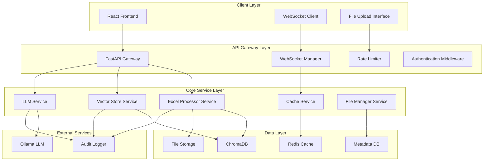
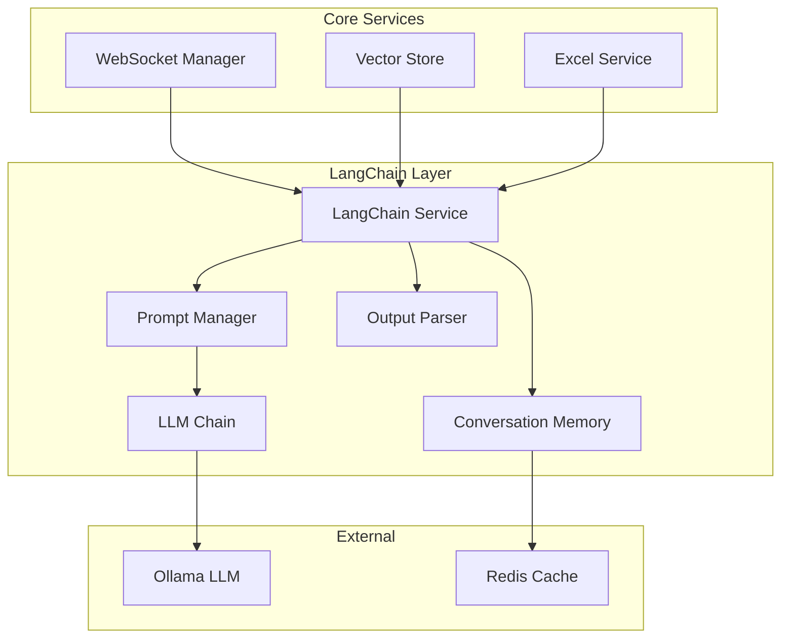

# Excel Chat Agent - System Architecture Design

## Executive Summary

This document outlines a production-ready system architecture for an Excel chat agent supporting 5-10 concurrent users with 50-100 Excel files, designed for on-premise deployment with local LLM processing.

## 1. High-Level System Architecture



## 2. Component Specifications

### 2.1 Service Architecture Components

#### **API Gateway Layer**
- **FastAPI Gateway**: Central entry point with OpenAPI documentation
- **WebSocket Manager**: Real-time communication hub with connection pooling
- **Rate Limiter**: Request throttling (100 req/min per user)
- **Authentication Middleware**: JWT-based auth with future AD integration

#### **Core Service Layer**
- **Excel Processor Service**: File parsing, metadata extraction, chunking
- **Vector Store Service**: Semantic embedding and similarity search
- **LLM Service**: Natural language processing and response generation
- **Cache Service**: Multi-layer caching for performance optimization
- **File Manager Service**: Upload, validation, storage, and lifecycle management

#### **Data Layer**
- **ChromaDB**: Vector database for semantic search
- **Redis Cache**: Session, query, and response caching
- **File Storage**: Structured filesystem with backup strategy
- **Metadata DB**: SQLite for file metadata and user sessions

### 2.2 Detailed Component Responsibilities

#### **Excel Processor Service**
```python
class ExcelProcessorService:
    """
    Responsibilities:
    - Parse Excel files with pandas/openpyxl
    - Extract metadata (sheets, columns, data types, statistics)
    - Generate text representations for vectorization
    - Handle large files with chunking strategy
    - Validate file integrity and format
    """
    
    async def process_file(self, file_path: str) -> ProcessedFile
    async def extract_metadata(self, file_path: str) -> FileMetadata
    async def generate_text_chunks(self, file_path: str) -> List[TextChunk]
    async def validate_file(self, file_path: str) -> ValidationResult
    async def handle_large_file(self, file_path: str) -> ChunkedResult
```

#### **Vector Store Service**
```python
class VectorStoreService:
    """
    Responsibilities:
    - Embed text chunks using SentenceTransformers
    - Store vectors in ChromaDB with metadata
    - Perform semantic similarity search
    - Manage collection lifecycle
    - Handle batch operations for performance
    """
    
    async def embed_and_store(self, chunks: List[TextChunk]) -> StorageResult
    async def semantic_search(self, query: str, filters: Dict) -> SearchResults
    async def batch_process(self, files: List[str]) -> BatchResult
    async def reindex_collection(self, collection_name: str) -> IndexResult
```

#### **LLM Service**
```python
class LLMService:
    """
    Responsibilities:
    - Interface with Ollama for text generation
    - Manage conversation context and memory
    - Generate streaming responses for real-time chat
    - Provide specialized prompts for different query types
    - Handle token counting and optimization
    """
    
    async def generate_response(self, query: str, context: List[str]) -> Response
    async def stream_response(self, query: str, context: List[str]) -> AsyncGenerator
    async def analyze_intent(self, query: str) -> QueryIntent
    async def recommend_charts(self, data_summary: str) -> ChartRecommendation
```

### 2.3 LangChain Integration Architecture

#### **Strategic Decision: LangChain vs Direct Ollama**

After comprehensive analysis, **LangChain is included** in the architecture for the following critical reasons:

**Core Benefits for Excel Chat Agent:**
- **Prompt Management**: Structured templates for different query types (analysis, visualization, comparison)
- **Conversation Memory**: Automatic context retention across chat sessions
- **Output Parsing**: Structured JSON responses for chart recommendations and data analysis
- **Streaming Support**: Real-time response generation with proper token handling
- **Error Resilience**: Built-in retry logic and connection management

#### **LangChain Components Used**

```python
class LangChainService:
    """
    Selective LangChain integration focusing on essential components
    """
    
    # Core Components (USED)
    from langchain.llms import Ollama
    from langchain.prompts import PromptTemplate, ChatPromptTemplate
    from langchain.memory import ConversationBufferWindowMemory
    from langchain.chains import LLMChain
    from langchain.output_parsers import PydanticOutputParser
    from langchain.schema import HumanMessage, AIMessage
    
    # Advanced Components (NOT USED - avoiding complexity)
    # from langchain.agents import *  # No autonomous agents needed
    # from langchain.vectorstores import *  # Using ChromaDB directly
    # from langchain.document_loaders import *  # Custom Excel processor
    
    def __init__(self):
        self.llm = Ollama(model="llama3", base_url="http://localhost:11434")
        self.memory = ConversationBufferWindowMemory(k=10, return_messages=True)
        
        # Specialized prompts for Excel data analysis
        self.prompts = {
            "data_analysis": PromptTemplate(...),
            "visualization": PromptTemplate(...),
            "comparison": PromptTemplate(...),
            "statistical": PromptTemplate(...)
        }
```

#### **Architecture Integration Points**



#### **Performance Impact Analysis**

| Aspect | Direct Ollama | With LangChain | Decision |
|--------|---------------|----------------|----------|
| **Development Time** | +2-3 weeks | Baseline | ✅ LangChain |
| **Memory Management** | Manual implementation | Automatic | ✅ LangChain |
| **Prompt Templates** | String formatting | Structured templates | ✅ LangChain |
| **Output Parsing** | Manual JSON parsing | Pydantic integration | ✅ LangChain |
| **Runtime Overhead** | ~0ms | ~5-10ms | ✅ Acceptable |
| **Dependencies** | 1 (ollama) | 2 (ollama + langchain) | ✅ Acceptable |

#### **Implementation Strategy**

**Phase 1: Core LangChain Integration**
```python
# Essential components for MVP
- PromptTemplate for query types
- ConversationBufferWindowMemory for chat context
- Basic LLMChain for response generation
- Simple output parsing for structured responses
```

**Phase 2: Advanced Features**
```python
# Enhanced capabilities
- PydanticOutputParser for chart recommendations
- Custom chains for complex analysis workflows
- Advanced memory strategies for user preferences
- Integration with caching layer
```

#### **Alternative Evaluation Results**

**Manual Implementation Cost:**
- Conversation memory system: ~40 hours
- Prompt template engine: ~20 hours  
- Output parsing framework: ~30 hours
- **Total**: ~90 hours vs 8 hours with LangChain

**Technical Risk Assessment:**
- Manual memory management: High complexity, bugs prone
- Prompt template maintenance: Difficult scaling
- Output parsing: JSON parsing edge cases
- **LangChain Risk**: Low - well-tested, maintained library

#### **Decision Summary**

✅ **LangChain is INCLUDED and ESSENTIAL** for this Excel Chat Agent because:

1. **Accelerates Development**: 2-3 weeks faster implementation
2. **Critical Features**: Memory, templates, and parsing are core requirements
3. **Maintainability**: Cleaner, more maintainable codebase
4. **Selective Usage**: Only necessary components, avoiding bloat
5. **ROI Positive**: Benefits significantly outweigh complexity costs

The Excel Chat Agent requires sophisticated conversation management, multiple prompt types, and structured outputs - exactly what LangChain provides efficiently.

## 3. Data Models and Relationships

### 3.1 Core Data Models

```python
from pydantic import BaseModel, Field
from typing import List, Optional, Dict, Any
from datetime import datetime
from enum import Enum

class FileMetadata(BaseModel):
    file_id: str = Field(..., description="Unique file identifier")
    file_name: str
    file_path: str
    file_hash: str
    file_size_mb: float
    upload_timestamp: datetime
    last_modified: datetime
    user_id: str
    processing_status: ProcessingStatus
    sheet_count: int
    total_rows: int
    total_columns: int
    
class SheetMetadata(BaseModel):
    sheet_id: str
    file_id: str
    sheet_name: str
    row_count: int
    column_count: int
    column_types: Dict[str, str]
    sample_data: List[Dict[str, Any]]
    statistics: Dict[str, Any]
    
class TextChunk(BaseModel):
    chunk_id: str
    file_id: str
    sheet_id: str
    content: str
    chunk_type: ChunkType  # metadata, data, statistics
    row_range: Optional[tuple[int, int]]
    embedding_vector: Optional[List[float]]
    
class QuerySession(BaseModel):
    session_id: str
    user_id: str
    created_at: datetime
    last_activity: datetime
    message_count: int
    file_filters: List[str]
    preferences: Dict[str, Any]
    
class ChatMessage(BaseModel):
    message_id: str
    session_id: str
    user_id: str
    content: str
    message_type: MessageType  # user, assistant, system
    timestamp: datetime
    sources: List[str]
    confidence_score: Optional[float]
    processing_time_ms: Optional[int]
```

### 3.2 Database Schema Design

```sql
-- SQLite schema for metadata
CREATE TABLE files (
    file_id TEXT PRIMARY KEY,
    file_name TEXT NOT NULL,
    file_path TEXT NOT NULL,
    file_hash TEXT UNIQUE NOT NULL,
    file_size_mb REAL NOT NULL,
    upload_timestamp DATETIME NOT NULL,
    last_modified DATETIME NOT NULL,
    user_id TEXT NOT NULL,
    processing_status TEXT NOT NULL,
    sheet_count INTEGER NOT NULL,
    total_rows INTEGER NOT NULL,
    total_columns INTEGER NOT NULL,
    created_at DATETIME DEFAULT CURRENT_TIMESTAMP,
    updated_at DATETIME DEFAULT CURRENT_TIMESTAMP
);

CREATE TABLE sheets (
    sheet_id TEXT PRIMARY KEY,
    file_id TEXT NOT NULL,
    sheet_name TEXT NOT NULL,
    row_count INTEGER NOT NULL,
    column_count INTEGER NOT NULL,
    column_types TEXT NOT NULL, -- JSON
    sample_data TEXT NOT NULL,  -- JSON
    statistics TEXT NOT NULL,   -- JSON
    FOREIGN KEY (file_id) REFERENCES files (file_id)
);

CREATE TABLE query_sessions (
    session_id TEXT PRIMARY KEY,
    user_id TEXT NOT NULL,
    created_at DATETIME NOT NULL,
    last_activity DATETIME NOT NULL,
    message_count INTEGER DEFAULT 0,
    file_filters TEXT,  -- JSON
    preferences TEXT    -- JSON
);

CREATE TABLE chat_messages (
    message_id TEXT PRIMARY KEY,
    session_id TEXT NOT NULL,
    user_id TEXT NOT NULL,
    content TEXT NOT NULL,
    message_type TEXT NOT NULL,
    timestamp DATETIME NOT NULL,
    sources TEXT,  -- JSON
    confidence_score REAL,
    processing_time_ms INTEGER,
    FOREIGN KEY (session_id) REFERENCES query_sessions (session_id)
);

-- Indexes for performance
CREATE INDEX idx_files_user_id ON files (user_id);
CREATE INDEX idx_files_hash ON files (file_hash);
CREATE INDEX idx_sheets_file_id ON sheets (file_id);
CREATE INDEX idx_sessions_user_id ON query_sessions (user_id);
CREATE INDEX idx_messages_session_id ON chat_messages (session_id);
CREATE INDEX idx_messages_timestamp ON chat_messages (timestamp);
```

## 4. API Design Patterns

### 4.1 RESTful API Endpoints

```python
# FastAPI route definitions
@app.get("/api/health")
async def health_check() -> HealthStatus

@app.get("/api/files", dependencies=[Depends(auth_required)])
async def list_files(
    user_id: str = Depends(get_current_user),
    limit: int = Query(20, le=100),
    offset: int = Query(0, ge=0)
) -> PaginatedResponse[FileMetadata]

@app.post("/api/files/upload", dependencies=[Depends(auth_required)])
async def upload_file(
    file: UploadFile,
    user_id: str = Depends(get_current_user)
) -> UploadResponse

@app.post("/api/query", dependencies=[Depends(auth_required)])
async def query_data(
    request: QueryRequest,
    user_id: str = Depends(get_current_user)
) -> QueryResponse

@app.get("/api/files/{file_id}/analyze", dependencies=[Depends(auth_required)])
async def analyze_file(
    file_id: str,
    user_id: str = Depends(get_current_user)
) -> FileAnalysis

@app.delete("/api/files/{file_id}", dependencies=[Depends(auth_required)])
async def delete_file(
    file_id: str,
    user_id: str = Depends(get_current_user)
) -> DeleteResponse

@app.get("/api/stats", dependencies=[Depends(auth_required)])
async def system_stats(
    admin_user: str = Depends(require_admin)
) -> SystemStats
```

### 4.2 WebSocket Communication Protocol

```python
class WebSocketMessage(BaseModel):
    type: MessageType
    content: Optional[str] = None
    data: Optional[Dict[str, Any]] = None
    session_id: str
    timestamp: datetime
    request_id: Optional[str] = None

class MessageType(str, Enum):
    USER_MESSAGE = "user_message"
    ASSISTANT_RESPONSE = "assistant_response"
    SYSTEM_NOTIFICATION = "system_notification"
    TYPING_INDICATOR = "typing_indicator"
    ERROR = "error"
    HEARTBEAT = "heartbeat"
    SESSION_START = "session_start"
    SESSION_END = "session_end"
    FILE_UPLOAD_PROGRESS = "file_upload_progress"
    PROCESSING_STATUS = "processing_status"

# WebSocket event handlers
@app.websocket("/ws/{session_id}")
async def websocket_endpoint(
    websocket: WebSocket,
    session_id: str,
    token: str = Query(...)
):
    # Authentication and connection management
    # Message routing and response streaming
    # Error handling and reconnection logic
```

## 5. Performance and Scalability Considerations

### 5.1 Caching Strategy (Multi-Layer)

```python
class CacheStrategy:
    """
    L1: In-Memory Cache (Redis) - Hot data, 15-minute TTL
    L2: Application Cache - Processed file metadata, 1-hour TTL
    L3: Vector Cache - Embedding results, 24-hour TTL
    L4: Response Cache - Common queries, 30-minute TTL
    """
    
    # Hot cache for active sessions
    session_cache = Redis(db=0, ttl=900)  # 15 minutes
    
    # File metadata cache
    file_cache = Redis(db=1, ttl=3600)   # 1 hour
    
    # Vector embedding cache
    vector_cache = Redis(db=2, ttl=86400)  # 24 hours
    
    # Query response cache
    response_cache = Redis(db=3, ttl=1800)  # 30 minutes
```

### 5.2 Async Processing Patterns

```python
import asyncio
from concurrent.futures import ThreadPoolExecutor, ProcessPoolExecutor

class AsyncProcessingManager:
    def __init__(self):
        self.thread_pool = ThreadPoolExecutor(max_workers=4)
        self.process_pool = ProcessPoolExecutor(max_workers=2)
        
    async def process_file_async(self, file_path: str) -> ProcessedFile:
        """CPU-intensive file processing in separate process"""
        loop = asyncio.get_event_loop()
        return await loop.run_in_executor(
            self.process_pool, 
            self._process_file_sync, 
            file_path
        )
    
    async def generate_embeddings_async(self, texts: List[str]) -> List[List[float]]:
        """Embedding generation in thread pool"""
        loop = asyncio.get_event_loop()
        return await loop.run_in_executor(
            self.thread_pool,
            self._generate_embeddings_sync,
            texts
        )
```

### 5.3 Connection Pooling

```python
import aioredis
import chromadb
from sqlalchemy.ext.asyncio import create_async_engine

class ConnectionManager:
    def __init__(self):
        # Redis connection pool
        self.redis_pool = aioredis.ConnectionPool.from_url(
            "redis://localhost:6379",
            max_connections=20,
            retry_on_timeout=True
        )
        
        # SQLite async engine
        self.db_engine = create_async_engine(
            "sqlite+aiosqlite:///./excel_agent.db",
            pool_size=10,
            max_overflow=20,
            pool_pre_ping=True
        )
        
        # ChromaDB client with connection reuse
        self.chroma_client = chromadb.PersistentClient(
            path="./chroma_db",
            settings=chromadb.Settings(
                allow_reset=True,
                is_persistent=True
            )
        )
```

### 5.4 Scalability Patterns (10 → 100+ Users)

```python
class ScalabilityConfiguration:
    """
    Current (5-10 users):
    - Single instance deployment
    - Local file storage
    - In-memory + Redis caching
    
    Growth (25-50 users):
    - Horizontal scaling with load balancer
    - Shared storage (NFS/MinIO)
    - Redis Cluster
    
    Scale (100+ users):
    - Microservice decomposition
    - Database sharding by user_id
    - Message queue for async processing
    - Dedicated vector database cluster
    """
    
    CURRENT_TIER = {
        "max_users": 10,
        "max_files": 100,
        "instance_count": 1,
        "cache_size": "2GB",
        "vector_collections": 1
    }
    
    GROWTH_TIER = {
        "max_users": 50,
        "max_files": 500,
        "instance_count": 3,
        "cache_size": "8GB",
        "vector_collections": 5,
        "load_balancer": True
    }
    
    SCALE_TIER = {
        "max_users": 200,
        "max_files": 2000,
        "instance_count": 10,
        "cache_size": "32GB",
        "vector_collections": 20,
        "microservices": True,
        "message_queue": True
    }
```

## 6. Security and Compliance Architecture

### 6.1 Authentication and Authorization

```python
class SecurityManager:
    """
    Current: JWT-based authentication
    Future: Active Directory integration
    Audit: All operations logged with user context
    """
    
    def __init__(self):
        self.jwt_secret = os.getenv("JWT_SECRET_KEY")
        self.token_expiry = timedelta(hours=8)
        self.refresh_expiry = timedelta(days=7)
    
    async def authenticate_user(self, credentials: UserCredentials) -> AuthResult:
        # Current: Local user validation
        # Future: AD/LDAP integration
        pass
    
    async def authorize_file_access(self, user_id: str, file_id: str) -> bool:
        # Row-level security for file access
        pass
    
    async def log_audit_event(self, user_id: str, action: str, resource: str):
        # Comprehensive audit logging
        pass

class AuditLogger:
    """
    Security event logging for compliance
    """
    
    async def log_file_access(self, user_id: str, file_id: str, action: str):
        await self._log_event({
            "event_type": "file_access",
            "user_id": user_id,
            "file_id": file_id,
            "action": action,
            "timestamp": datetime.utcnow(),
            "ip_address": self._get_client_ip(),
            "user_agent": self._get_user_agent()
        })
    
    async def log_query_execution(self, user_id: str, query: str, files_accessed: List[str]):
        await self._log_event({
            "event_type": "query_execution",
            "user_id": user_id,
            "query_hash": hashlib.sha256(query.encode()).hexdigest(),
            "files_accessed": files_accessed,
            "timestamp": datetime.utcnow()
        })
```

### 6.2 Data Protection and Privacy

```python
class DataProtectionManager:
    """
    Data protection and privacy controls
    """
    
    def __init__(self):
        self.encryption_key = Fernet.generate_key()
        self.fernet = Fernet(self.encryption_key)
    
    async def encrypt_sensitive_data(self, data: str) -> str:
        """Encrypt PII data in Excel files"""
        return self.fernet.encrypt(data.encode()).decode()
    
    async def mask_sensitive_columns(self, df: pd.DataFrame) -> pd.DataFrame:
        """Automatically detect and mask PII columns"""
        sensitive_patterns = {
            'email': r'\b[A-Za-z0-9._%+-]+@[A-Za-z0-9.-]+\.[A-Z|a-z]{2,}\b',
            'phone': r'\b\d{3}-\d{3}-\d{4}\b',
            'ssn': r'\b\d{3}-\d{2}-\d{4}\b'
        }
        
        for column in df.columns:
            for pattern_type, pattern in sensitive_patterns.items():
                if df[column].astype(str).str.contains(pattern, regex=True).any():
                    df[column] = df[column].apply(self._mask_value)
        
        return df
    
    def _mask_value(self, value: str) -> str:
        """Mask sensitive values while preserving format"""
        if len(value) > 4:
            return value[:2] + '*' * (len(value) - 4) + value[-2:]
        return '*' * len(value)
```

## 7. Deployment Architecture

### 7.1 On-Premise Deployment (Current)

```yaml
# docker-compose.production.yml
version: '3.8'

services:
  nginx:
    image: nginx:alpine
    ports:
      - "80:80"
      - "443:443"
    volumes:
      - ./nginx.conf:/etc/nginx/nginx.conf
      - ./ssl:/etc/nginx/ssl
    depends_on:
      - backend

  backend:
    build: ./backend
    environment:
      - ENVIRONMENT=production
      - REDIS_URL=redis://redis:6379
      - OLLAMA_URL=http://ollama:11434
    volumes:
      - ./data:/app/data
      - ./logs:/app/logs
    depends_on:
      - redis
      - ollama
    deploy:
      replicas: 2
      resources:
        limits:
          memory: 4G
          cpus: '2'

  frontend:
    build: ./frontend
    environment:
      - NODE_ENV=production
    depends_on:
      - backend

  redis:
    image: redis:7-alpine
    command: redis-server --appendonly yes --maxmemory 2gb
    volumes:
      - redis_data:/data
    deploy:
      resources:
        limits:
          memory: 2G

  ollama:
    image: ollama/ollama:latest
    volumes:
      - ollama_data:/root/.ollama
    environment:
      - OLLAMA_MODELS=llama3:8b
    deploy:
      resources:
        limits:
          memory: 8G
          cpus: '4'

volumes:
  redis_data:
  ollama_data:
```

### 7.2 Scalable Deployment (Future)

```yaml
# kubernetes deployment for scale
apiVersion: apps/v1
kind: Deployment
metadata:
  name: excel-chat-backend
spec:
  replicas: 5
  selector:
    matchLabels:
      app: excel-chat-backend
  template:
    spec:
      containers:
      - name: backend
        image: excel-chat-backend:latest
        resources:
          requests:
            memory: "1Gi"
            cpu: "500m"
          limits:
            memory: "2Gi"
            cpu: "1000m"
        env:
        - name: REDIS_CLUSTER_URL
          value: "redis-cluster:6379"
        - name: CHROMA_CLUSTER_URL
          value: "chroma-cluster:8000"
```

### 7.3 Monitoring and Observability

```python
import logging
import prometheus_client
from opentelemetry import trace
from opentelemetry.exporter.jaeger.thrift import JaegerExporter

class MonitoringSetup:
    def __init__(self):
        # Prometheus metrics
        self.request_count = prometheus_client.Counter(
            'http_requests_total',
            'Total HTTP requests',
            ['method', 'endpoint', 'status']
        )
        
        self.request_duration = prometheus_client.Histogram(
            'http_request_duration_seconds',
            'HTTP request duration'
        )
        
        self.file_processing_time = prometheus_client.Histogram(
            'file_processing_duration_seconds',
            'Time to process Excel files'
        )
        
        self.vector_search_time = prometheus_client.Histogram(
            'vector_search_duration_seconds',
            'Vector search execution time'
        )
        
        # Distributed tracing
        tracer = trace.get_tracer(__name__)
        jaeger_exporter = JaegerExporter(
            agent_host_name="jaeger",
            agent_port=6831
        )

# Health checks
@app.get("/health")
async def health_check():
    checks = {
        "database": await check_database_health(),
        "redis": await check_redis_health(),
        "chroma": await check_chroma_health(),
        "ollama": await check_ollama_health(),
        "disk_space": await check_disk_space()
    }
    
    status = "healthy" if all(checks.values()) else "unhealthy"
    return {"status": status, "checks": checks}
```

## 8. Implementation Roadmap

### Phase 1: Core MVP (Weeks 1-2)
- [ ] Basic FastAPI application structure with UV
- [ ] Excel file upload and processing
- [ ] Simple ChromaDB integration
- [ ] Basic Ollama LLM integration
- [ ] Simple React chat interface
- [ ] WebSocket communication

### Phase 2: Production Features (Weeks 3-4)
- [ ] Authentication and authorization
- [ ] Comprehensive caching strategy
- [ ] Error handling and resilience
- [ ] File management and lifecycle
- [ ] Advanced query capabilities
- [ ] Audit logging

### Phase 3: Scale and Security (Weeks 5-6)
- [ ] Performance optimization
- [ ] Security hardening
- [ ] Monitoring and observability
- [ ] Load testing and optimization
- [ ] Documentation and deployment guides
- [ ] Admin dashboard

### Phase 4: Advanced Features (Weeks 7-8)
- [ ] Advanced analytics and visualization
- [ ] Multi-file comparison and analysis
- [ ] Custom prompt templates
- [ ] Integration APIs
- [ ] Automated testing suite
- [ ] CI/CD pipeline

## 9. Risk Assessment and Mitigation

### Technical Risks
| Risk | Impact | Probability | Mitigation |
|------|--------|-------------|------------|
| Ollama performance bottleneck | High | Medium | Connection pooling, request queuing, model optimization |
| Vector search latency | Medium | Low | Proper indexing, caching, query optimization |
| Memory exhaustion (large files) | High | Medium | Streaming processing, chunking, resource limits |
| WebSocket connection drops | Medium | Medium | Auto-reconnect, heartbeat, connection resilience |

### Security Risks
| Risk | Impact | Probability | Mitigation |
|------|--------|-------------|------------|
| Unauthorized file access | High | Low | Row-level security, audit logging, access controls |
| Data leakage through LLM | High | Low | Context sanitization, PII masking, query filtering |
| File upload vulnerabilities | Medium | Medium | File validation, sandboxing, antivirus scanning |

### Operational Risks
| Risk | Impact | Probability | Mitigation |
|------|--------|-------------|------------|
| Disk space exhaustion | High | Medium | Storage monitoring, cleanup policies, alerts |
| Service dependencies failure | High | Low | Health checks, circuit breakers, graceful degradation |
| Data corruption | High | Low | Regular backups, checksums, validation |

## Conclusion

This architecture provides a solid foundation for the Excel chat agent that can start simple and scale elegantly. The design emphasizes:

1. **Separation of Concerns**: Clear service boundaries for maintainability
2. **Performance**: Multi-layer caching and async processing
3. **Scalability**: Horizontal scaling patterns and resource optimization
4. **Security**: Authentication, authorization, and audit capabilities
5. **Reliability**: Error handling, monitoring, and resilience patterns

The architecture supports current requirements (5-10 users, 50-100 files) while providing clear paths for scaling to 100+ users through horizontal scaling, microservice decomposition, and advanced caching strategies.